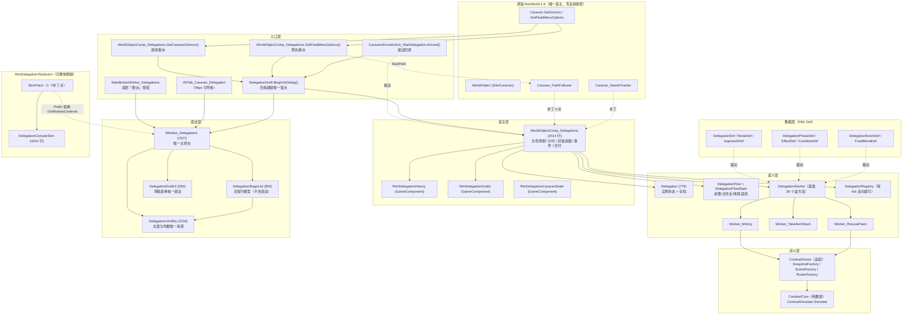
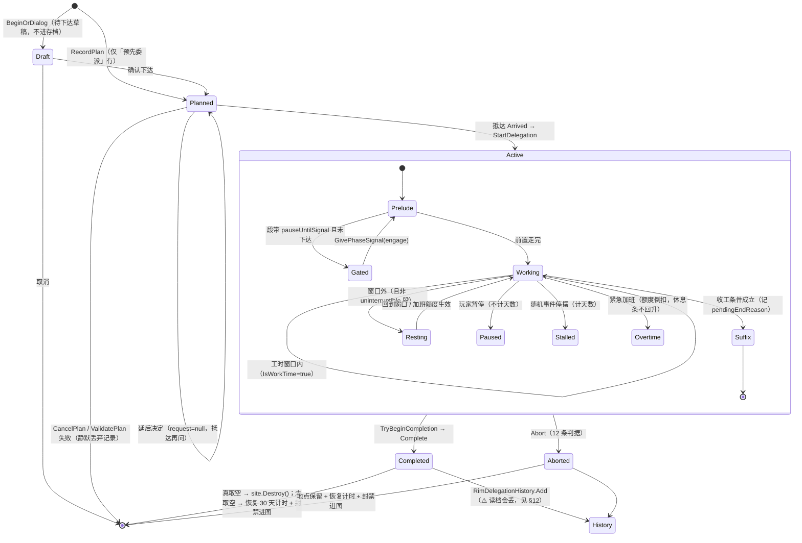

# 委派系统 · 现状审计与证据
### （Audit & Evidence · RimDelegation）

> **本文档的地位**：文档集里**证据与风险**那一份。规范侧见 `docs/委派系统-设计文档.md`（设计与需求基线），操作侧见 `docs/委派系统-设计者文档.md`（设计与操作指南）。
> 本文保留**审计原貌**：所有结论都带 `文件:行号`，未验证项集中在 §12-S，末尾 **附录 A** 是《抽象采矿远征》初稿与现状的差异对照表。

> 生成方式：**只读分析**。依据＝工作区真实文件内容（源码 / Defs / Patches / Languages / 脚本 / 编译产物 / `Player.log` / 两份 ModSettings）+ RimWorld 1.6 反编译（`Assembly-CSharp.dll`，MVID `61e4173561894da49d210260257b5097`）+ rimsearcher Def 真值。
> 本报告没有依据聊天记忆；凡无法验证处标 **「需要确认」**；凡来自文档而非代码处标 **`[DESIGN 声明]`**。
> 分析过程**未修改任何代码、未执行构建、未 git 操作**。
>
> **行号口径**：本文行号＝UTF-8 全文行数（`[System.IO.File]::ReadAllLines().Count`）。注意 PowerShell `Get-Content | Measure-Object -Line` 会漏掉空行、得出偏小的数（例如 `WorldObjectComp_Delegations.cs` 实为 **2414** 行，该口径会报 1967），本文一律用前者。
> **时点**：源码最后修改 `2026-09-28 20:08`；本体 dll 构建 `2026-09-28 20:09`；皮肤 dll 构建 `2026-09-28 20:33`；最后一次游戏运行 `Player.log` `2026-09-28 20:29:43`。
>
> ---
>
> ### ⚠️ RIM-3 更新（2026-10-05）：皮肤并入本体 —— 本审计里已作废 / 已修正的条目
>
> 本文其余部分保留 **2026-09-30 审计原貌**（证据价值就在于"当时是什么样"）。**读本文时必须叠加下面这份修正清单**：
>
> 1. **皮肤不再是独立 mod**：`RimDelegation-RadiusUI\` 目录**已删除**；皮肤源码并入 `RimDelegation\Source\Skin\`（3 个 .cs / 4,481 行，命名空间仍是 `RimDelegationRadiusUI`），与本体**同一个 dll**。
>    ⇒ 本地作废处：§0 已完成第 7 条（"两套 UI 并行 / 可一键回退"）、§2 架构图的皮肤 subgraph、§4 模块表的皮肤行、§6 的画法层分工、§11-B（"主线零 Harmony 破了"）、§12-Q **全部四条**、§12-J 的"皮肤部署脚本 / 皮肤强耦合"、§14-§15 的皮肤路径与"先本体后皮肤"编译顺序 —— **全部作废**。
> 2. **Harmony 补丁点从 5 个变回 4 个**：主控台绘制改走 `Window_Delegations.DoWindowContents` **直接调用** `DelegationConsoleSkin.Draw`，不再是 Prefix 补丁；`SkinPatch.cs` / `RadiusUISkinMod.cs` / 皮肤 `ModBoot.cs` / 皮肤 `deploy.ps1` / 皮肤 `README.md` / `RimDelegation.RadiusUI.csproj` 随目录一并删除。
> 3. **`astryl.RadiusUI.Framework` 是本体的硬依赖**（编译期强引用 + `About.xml` 的 `modDependencies` 带 `steamWorkshopUrl` + `loadAfter`）。皮肤那两个开关（`enabled` / `skinConsole`）与标题栏「切回原版」**已删**；皮肤的 `RadiusUISkinSettings` 并入 `RimDelegationSettings`（新增 `pinnedSites` / `collapsedLeft..Rail` / `pinnedLeft..Rail` / `hoverFocus` 共 10 键）。⇒ 旧皮肤配置文件（`..._RadiusUISkinMod.xml`）不再被读取。
> 4. **皮肤"依赖缺 URL"警告已消**（那条依赖随皮肤 About.xml 删除；本体 About.xml 两条依赖都带 URL）。
> 5. **版本控制已建**：RIM-2（2026-10-05）在工作区根建了 git 仓库（`0dad4fc` 初始提交，白名单 `.gitignore` 只放行两个 mod 目录）⇒ §0 最大风险第 3 条**部分缓解**；**远程 GitHub 仓库尚未推送**。
> 6. **规模数字已过期**（本文写 74 文件 / 23,165 行 / 4 条委派 / 11 段）：RIM-1 更正为 76 文件 / 23,623 行 / 5 条委派 / 18 段；**RIM-3 后**为 **80 个 .cs / 28,239 行**（其中 `Source\Skin\` 3 个 / 4,481 行）。产物：`RimDelegation.dll` **346,112 B / SHA256 `0A980D00EBDE5214…`**（2026-10-05 20:34:15），游戏侧同哈希；旧 `RimDelegation.RadiusUI.dll`（75,776 B / `6CFD1302…`）**已删除**。
> 7. **仍然成立的两条**：皮肤硬编码中文（数量级不变，路径换成 `Source/Skin/DelegationConsoleSkin.cs`）、"皮肤独用 25 个 key 原版源码不再引用"。**已随文件删除消失的两条**：皮肤 README/About.xml 过期（§12-Q 第 1/5 条）、皮肤部署脚本缺 ERROR 检测（§12-Q 第 3 条）。
>
> ### ⚠️ RIM-6 / RIM-9 更新（2026-10-05 晚）
>
> 1. **RIM-9：收工签核窗口已半径化**（本文多处写"`Widgets.FillableBar` 只留在旧对话框与签核报告窗"、
>    "签核报告窗走原版画法" **均已过期**）。现在窗口底与正文都走 Radius：新增 `Source/Skin/ReportSkin.cs`
>    （历史详情与签核窗口**共用**这一份排版），`ConsoleWindowBridge` 的参数类型放宽到 `Window`。
>    原版画法的 `DelegationReportUI` **保留**，只在皮肤不可用时兜底。
>    ⇒ 源码规模：`Source/Skin/` **4 个 .cs**（原 3 个）；产物 `RimDelegation.dll` **347,136 B /
>    SHA256 `EAE62E48DBB3A578…`**（2026-10-05 21:49）。
> 2. **RIM-6：列头折叠开关改成"自绘几何 + 底色"**（不再用 `ButtonStyle.Ghost` + 全角 `－/＋` 当唯一视觉载体）；
>    `DelegationConsoleSkin.DrawColumnToggle` 多了 `DrawCollapseToggle` 与 `ColBtnW/BtnGap` 两个常量。
> 3. **顺手修掉 §9.3 / §12-R 之外的一条本地化缺陷**：`Languages/English/Keyed/RimDelegation.xml:64`
>    注释里的 `--` 曾让**整份 59 key 静默作废**（中文那份正常，只在英文环境暴露）；RIM-9 顺手改成 `—`。
>    修后中英各 **63 key、键集合完全相同**。`tools/Check-DefsXml.ps1` 仍**只扫 `Defs\`**（缺口未补）。

---

## 0. 结论摘要

**一句话当前状态**
RimDelegation 已经从「矿点委派」长成了一个**可用的世界地图委派框架**（4 条委派 / 2 姿态 / 4 模式 / 11 个流程段 / 7 条随机事件 / 1 套无地图战斗结算 / 原版主控台 + Radius UI 皮肤），代码 74 文件 23,165 行、Defs 4 份、已编译并镜像到游戏 `Mods`；但**当前部署在游戏里的这一份 dll 含一个存档级 bug**：三个 `GameComponent` 子类缺 `(Game)` 构造函数，导致**每次读档都会丢弃全部委派历史记录与车队解锁名单**，且该现象已在 `Player.log` 里复现（尚未修）。

> ⚠️ **RIM-3 后（2026-10-05）这句话里的数字与"两套 UI"都过期了**：委派 **5 条**、流程段 **18 段**、源码 **80 个 .cs / 28,239 行**（含并入的皮肤）、**单一 dll 且只有皮肤一种画法**。P0 那条 `GameComponent` bug **仍未修**。

### 已完成（3–7 条）
1. **框架骨架与双入口全部跑通**：就地委派（车队 gizmo）/ 预先委派（右键 → 抵达自动开工），四条下达路径收敛到唯一落点 `DelegationDraft.BeginOrDialog`（`DelegationDraft.cs:207`）。
2. **4 条委派实装且在日志里确认为 4 条**：`RimDelegation_MinePreciousLump` / `RimDelegation_TakeItemStash` / `RimDelegation_RescuePrisoner` / `RimDelegation_RescueRefugee`（`Player.log:382-385`；Def 见 `Defs/RimDelegation_Delegations.xml:606/738/891/993`）。
3. **采矿速率完整照抄原版公式链**（`DelegationWorker_Mining.cs:37-67,134-208`：`TicksPerCell = 19 × round(100 / MiningSpeed)`，`MiningSpeed = 1 × (0.04 + 0.12 × 等级)`）。
4. **固定流程段机（前置 / 主作业 / 收尾）**：`DelegationPhaseDef` 17 个字段、11 条段 Def、开局冻结段表（`DelegationFlow.Freeze` `DelegationFlow.cs:238`），「有敌情」两岔流程纯 XML 可配。
5. **无地图战斗结算 + 缴获/打扫战场/尸体三档/收押俘虏**一条链打通（`CombatSimulator.Simulate`、`RescueUtility.ResolveClearance:441-570`、`DelegationEffectDef.cs:358`）。
6. **「不进图」这条硬约束用零 Harmony 的方式做实**：复用原版 `EnterCooldownComp`（`WorldObjectComp_Delegations.cs:1630/1672/1715/1816`），并覆盖老存档。
7. ~~**两套 UI 并行**：原版 `Window_Delegations`（1527 行，唯一面板）+ Radius UI 皮肤（1 个补丁点接管同一窗口实例），且皮肤可一键回退原版。~~ ⇒ **RIM-3 作废**：皮肤并入本体（同一个 dll / 同一工程），主控台**只有 Radius UI 一种画法**；回退开关、标题栏「切回原版」、皮肤 mod 目录全部移除（旧画法只作反射失败/异常时的兜底）。

### 未完成 / 半成品（3–7 条）
1. **`GameComponent` 构造函数 bug（P0）**：`RimDelegationHistory.cs:163`、`RimDelegationDrafts.cs:26`、`RimDelegationCaravanState.cs:23` 只有无参构造。
2. **S34（皮肤悬浮焦点不对称 + 列头图钉）未进游戏验收**：皮肤 dll 构建于 20:33，最后一次游戏运行 20:29（`DESIGN.md:5617-5618` 自述「待进游戏验收」）。
3. **段耗时 × 技能因子未挂钩**：`DelegationPhaseDef.skillDef` 目前只决定「谁去做 + 怎么显示」（`DelegationPhaseDef.cs:98-100`、`DESIGN.md:4977`）。
4. **离线战斗验证器已断**：`Prototype` / `CombatLab` 用 `..\Source\Combat\Core\*.cs` 通配编译，而 `CombatUnitSnapshot.cs:2` 已 `using Verse;`、`:74` 引用 `ThingDef`，且两个工程**没有任何 Verse/Assembly-CSharp 引用**。
5. **「收集任务」侧的战利品（哨所 / 工作站点）未实装**：只有口径，没有 Def（`DESIGN.md:5426-5434`）。
6. **历史记录页仍是旧版单块**（未按作战/收集/远行队拆三段）——`DESIGN.md:5135 / 5046`。
7. **原版侧三段仍是「大字 + 底色带」**（卡片底框只做了皮肤侧三个段）——`DESIGN.md:5280`。

### 最大风险（3 条）
1. **存档级数据丢失（已实证）**：三个 `GameComponent` 永远不会被自动注册 ⇒ 读档时 `ScribeExtractor.SaveableFromNode` 抛 `MissingMethodException`，**`RimDelegationHistory.records`（最多 60 条历史）与 `RimDelegationCaravanState.unlockedCaravanIds`（车队解锁名单）被整体丢弃**。证据：反编译 `Verse.Game.FillComponents()` 第 12 行 `Activator.CreateInstance(item2, this)` + `Player.log:656/662/664/822-850`（含 `<li Class="RimDelegation.RimDelegationHistory">…</li>` 原始存档节点）。
2. **「预告 ≠ 结算」的口径分叉（已有活的矛盾）**：「守军先手一轮」折扣在 4 处算法点，其中 **2 处带 `stealth` 条件、2 处不带**（见 §6.3）；`RimDelegation_Approach_Assault` 只写了 `<stealth>false</stealth>`（`RimDelegation_Delegations.xml:852`），`guardsGetFirstStrike` 取默认 `true`（`DelegationApproachDef.cs:50`）⇒ **囚犯营救选「强攻」时：主列成算的折扣 = 1.0、威胁评估对话框 = 0、真结算 = 0** —— 主列比真打少吃一轮敌方火力，且与同一面板的对话框互相矛盾。同源缺口还有两处：`ThreatAssessmentEntry.Open`（`:179`）**没有 `excludeFromCombat` 形参** ⇒ 评估对话框永远忽略「不参战」名单（主列与交战段都尊重它），而营救结算反向硬写 `null`（`RescueUtility.cs:484`）⇒ **S27 的「不参战」勾选对营救清场无效**；车队侧威胁评估入口 `WorldObjectComp_ThreatAssessment.cs:60` 调 `Open(caravan, Site)` **不传 penalty**（默认 `0f`）。
3. ~~**没有版本控制、也没有可回滚的快照**~~ ⇒ **RIM-2 已部分解决（2026-10-05）**：工作区根已建 git 仓库（`0dad4fc` 初始提交；白名单 `.gitignore` 只放行 `RimDelegation/` 与 `RimDelegation-RadiusUI/`），仍**未推送远程**、也没有打 tag。`DESIGN.md` 5666 行 + S0→S34 轮次史仍是文档级历史。

### 建议下一步（3–5 条）
1. **先修 P0（三个构造函数）再谈别的功能**：改 `public X(Game game) {}`（`GameComponent` 基类是 `protected` 无参，**不需要** `: base(game)`），并把 `ModBoot` 自检补一条；顺带删掉 `RimDelegationHistory.cs:159-161` / `RimDelegationDrafts.cs:24-25` 那两段把 API 说反的注释。
2. **大改前先给仓库留快照**（`git init` 三个目录或整包 zip），否则 §13 说的任何改动都没有回退点。
3. **把「守军先手」折扣归一成唯一来源**（一个函数：`(approach, stealthAttempt) → penalty`），并让车队侧评估入口把 penalty 传进去。
4. **修离线验证通道**：把 `CombatUnitSnapshot.IconDef` 换成 `string`/索引，或给 `Prototype`/`CombatLab` 加 Verse 桩 —— 这是「游戏外复演同一场战斗」的唯一通道。
5. **把文档与代码对账**（皮肤 `README.md` 仍描述已被 S18 删掉的三补丁点与对话框/页签皮肤；`RimDelegationSettings.stashItemsExpanded` 疑似失效），否则下一轮改动的成本估算会系统性失真。

---

## 1. 项目元信息

| 项 | 值 | 证据 |
|---|---|---|
| 显示名 | `RimDelegation 边缘委派` | `About/About.xml:3` |
| author | `duskmelon` | `About/About.xml:4` |
| packageId | `duskmelon.rimdelegation` | `About/About.xml:5` |
| 支持版本 | **仅 `1.6`** | `About/About.xml:6-8` |
| 依赖 | `brrainz.harmony`（带 steamWorkshopUrl `…/2009463077`） | `About/About.xml:19-26` |
| loadAfter | `brrainz.harmony` | `About/About.xml:28-30` |
| `LoadFolders.xml` | **不存在**（单版本 mod，正确做法） | 全仓库 glob 无命中 |
| Mod 类 | `RimDelegation.RimDelegationMod`（`RimDelegationMod.cs`，101 行）；无 `<modClass>` 声明 ⇒ 靠原版自动发现唯一的 `Verse.Mod` 子类 | `RimDelegationMod.cs`；**只有这一个 Mod 子类需要确认** |
| HarmonyId | `duskmelon.rimdelegation` | `ModBoot.cs:21` |
| csproj | 经典 csproj，`TargetFrameworkVersion v4.7.2`、`LangVersion latest`、`CodePage 65001`、`Deterministic true`、`OutputType Library` | `Source/RimDelegation.csproj:20-50` |
| 源码收集方式 | `<Compile Include="**\*.cs" Exclude="obj\**\*.cs;bin\**\*.cs" />` ⇒ **新增 .cs 无需改工程** | `Source/RimDelegation.csproj:94-96` |
| 输出 | `Source\..\Assemblies\`（Debug 与 Release 同路径） | `Source/RimDelegation.csproj:41 / 49` |
| 引用 | `System` / `System.Core` / `System.Xml` + `Assembly-CSharp` + `UnityEngine.{CoreModule,IMGUIModule,UIModule,TextRenderingModule,InputLegacyModule}` + `0Harmony`，全部 `<Private>False</Private>` | `Source/RimDelegation.csproj:52-91` |
| Harmony dll 来源 | `C:\Program Files (x86)\Steam\steamapps\workshop\content\294100\2009463077\Current\Assemblies`（1.6 游戏 `Managed` 里没有 `0Harmony.dll`） | `Source/RimDelegation.csproj:14-15` |
| RimWorld 版本（实测） | `RimWorld 1.6.4871 rev591`，Harmony `2.4.1.0` | `Player.log:25 / :380` |
| 皮肤 packageId | `duskmelon.rimdelegation.radiusui`，`modVersion 0.1.0`，支持 `1.6` | `RimDelegation-RadiusUI/About/About.xml:5-8 / 47` |
| 皮肤依赖 | `brrainz.harmony` + `astryl.RadiusUI.Framework`（`…/3786107692`）+ `duskmelon.rimdelegation` | `RimDelegation-RadiusUI/About/About.xml:24-45` |
| ⚠️ 皮肤打包警告 | 「Mod RimDelegation - Radius UI dependency (duskmelon.rimdelegation) needs to have `<downloadUrl>` and/or `<steamWorkshopUrl>` specified.」 | `Player.log:28` |
| 版本控制 | **无 git**（工作区根 / `RimDelegation` / `RimDelegation-RadiusUI` / `RimOre` 均无 `.git`） | 目录探测；`git log` 直接报 `fatal: not a git repository` |

**生命周期挂载点**：`ModBoot` 标 `[StaticConstructorOnStartup]`（`ModBoot.cs:17`），静态构造里 `new Harmony(HarmonyId)` + `harmony.PatchAll(typeof(ModBoot).Assembly)`（`ModBoot.cs:25-26`），随后打印一行版本/Def 计数并跑 5 组自检（`ModBoot.cs:28-57`）。

---

## 2. 目录与文件地图

### 2.1 顶层

```
D:\Game\Rimworld Dev\RimDelegation\
├─ About\About.xml                 24 行 / 1116 B（元信息 + 依赖）
├─ Assemblies\                     RimDelegation.dll 288,256 B（2026-09-28 20:09）+ .pdb
├─ Source\                         74 个 .cs / 23,165 行（另有 obj\ 编译中间物）
│  ├─ Combat\Core\                 **10 文件 / 2,068 行**（纯数值战斗核，9 个纯 System + 1 个破口）
│  ├─ Combat\Game\                 **6 文件 / 1,587 行**（引擎适配层，含 Dialog_ThreatAssessment）
│  └─ Properties\AssemblyInfo.cs   13 行
├─ Defs\                           4 个 XML / 1,461 行
├─ Patches\                        3 个 XML / 77 行
├─ Languages\                      ChineseSimplified + English，各 84 行 / 59 key
├─ Textures\UI\Icons\RimDelegation_Delegations.png  432 B
├─ Doc\                            3 个 SVG 规格图 + 3 篇方案评估 .md
├─ tools\                          Check-DefsXml.ps1 / Check-FontGlyphs.js / Check-RimWorldFonts.js
├─ CombatLab\                      非发布工程（net10.0-windows WinForms，游戏外战斗验证器）
├─ Prototype\                      非发布工程（net10.0，自测）
├─ DESIGN.md                       5,666 行 / 428 KB（唯一设计主线，含 S0→S34 轮次史）
├─ build.ps1 / deploy.ps1          编译 / 部署脚本（含 SHA256 自检）
├─ ItemStash-可行性评估.md          364 行
├─ 三站点委派头脑风暴.md             493 行
├─ 热重载-可行性评估.md             206 行
└─ docs\                           ← 文档集（三份，说明见本文头部与附录 A）
   ├─ 委派系统-设计文档.md           设计与需求基线（规范侧）
   ├─ 委派系统-设计者文档.md         设计与操作指南（操作侧）
   └─ 委派系统-现状审计与证据.md     本文（审计与证据）
```

### 2.2 源码规模（74 文件 / 23,165 行，按 ReadAllLines 口径）

| 层 | 文件（行数） | 小计 |
|---|---|---|
| **入口层** | `MainButtonWorker_Delegations`(125)、`MainTabWindow_Delegations`(44)、`WITab_Caravan_Delegation`(90)、`Dialog_ChooseDelegation`(119)、`Dialog_DelegationReport`(161)、`Dialog_SetDelegationEndCondition`(147)、`Dialog_EditDelegationParticipants`(186)、`CaravanArrivalAction_StartDelegation`(126)、`DebugGizmos_Delegations`(133) | 1,131（`Combat/Game/Dialog_ThreatAssessment` 297 行归入「战斗层」，不重复计） |
| **UI / 画法层** | `DelegationUIUtility`(**2234**)、`Window_Delegations`(**1527**)、`DelegationStageList`(802)、`DelegationDraftUI`(593)、`DelegationDraft`(464)、`DelegationReportUI`(63) | 5,683 |
| **宿主层** | `WorldObjectComp_Delegations`(**2414**)、`WorldObjectComp_CaravanLock`(57)、`WorldObjectComp_ThreatAssessment`(63)、`WorldObjectCompProperties_*`(13+12)、`Patch_Caravan*`(4 文件 220)、`RimDelegationHistory`(222)、`RimDelegationDrafts`(142)、`RimDelegationCaravanState`(121)、`RimDelegationMod`(101)、`RimDelegationSettings`(185)、`ModBoot`(337) | 3,887 |
| **语义层** | `Delegation`(779)、`DelegationUtility`(1016)、`RescueUtility`(777)、`DelegationFlow`(490)、`DelegationRegistry`(252)、`DelegationThreatSummary`(416)、`ThreatAssessmentEntry`(188)、`DelegationAmbient`(163)、`DelegationWorker`(290)、`DelegationWorker_TakeItemStash`(1020)、`DelegationWorker_RescuePawn`(540)、`DelegationWorker_Mining`(455) | 6,386 |
| **Def 数据层** | `DelegationEventDef`(573)、`DelegationEffectDef`(481)、`DelegationDef`(269)、`DelegationPhaseDef`(249)、`DelegationConditionDef`(153)、`DelegationFoodMoodDef`(108)、`DelegationModeDef`(90)、`DelegationApproachDef`(74) + 小件（`DelegationDeposit` 69、`DelegationRequest` 70、`DelegationEventLogEntry` 73、`DelegationItemLedgerEntry` 46、`DelegationPreview` 39、`DelegationPreviewItem` 59、`DelegationLootItem` 57） | 2,410 |
| **战斗层** | `Combat/Core`（**10 文件 / 2,068 行**：`CombatSimulator` 568、`CombatScene` 433、`SnapshotCodec` 236、`Forecast` 154、`CombatLog` 144、`CombatUnitSnapshot` 139、`CombatMath` 131、`CombatResult` 131、`XorShiftRng` 77、`IRng` 55）+ `Combat/Game`（**6 文件 / 1,587 行**：`ThreatRosterFactory` 477、`CombatSnapshotFactory` 406、`Dialog_ThreatAssessment` 297、`CombatSceneFactory` 261、`CombatTuning` 94、`RandRng` 52） | 3,655 |
| **非发布工程** | `Prototype`（`SelfTest` 883、`Program` 219、`Scenarios` 153）+ `CombatLab`（`MainForm` 1207、`LabPresets` 201、`LabModel` 273、`Program` 244） | 3,180 |

> 口径说明：上表 6 层合计 **23,152** 行，加 `Properties\AssemblyInfo.cs`（13 行）＝ **23,165 行**，与「74 个 .cs / 23,165 行」一致。`Dialog_ThreatAssessment`（297 行）归在战斗层、`Patch_Caravan*`（4 文件 220 行）归在宿主层，各只计一次。

### 2.3 Defs / Patches / Languages 清单

| 文件 | 行数 | 内容 |
|---|---|---|
| `Defs/RimDelegation_Delegations.xml` | **1076** | 7×`ThoughtDef`、4×`DelegationModeDef`、11×`DelegationPhaseDef`、4×`DelegationDef`、2×`DelegationApproachDef` |
| `Defs/RimDelegation_DelegationEvents.xml` | 237 | 1×`ThoughtDef` + 7×`DelegationEventDef` |
| `Defs/RimDelegation_FoodMood.xml` | 113 | 1×`ThoughtDef`（4 stage）+ 1×`DelegationFoodMoodDef` |
| `Defs/RimDelegation_MainButtons.xml` | 35 | 1×`MainButtonDef`（`order=66`、`validWithoutMap=true`） |
| `Patches/RimDelegation_SiteComps.xml` | 34 | 给 5 个 Site 类 `WorldObjectDef` 追加 2 个 comp |
| `Patches/RimDelegation_CaravanComps.xml` | 23 | 给 `WorldObjectDef[Caravan]` **新增 `<comps>` 节点**（原版该 def 本来没有 comps） |
| `Patches/RimDelegation_CaravanTabs.xml` | 20 | 给 `Caravan` 追加 `inspectorTabs` |
| `Languages/*/Keyed/RimDelegation.xml` | 84 ×2 | 各 **59 个 key**，中英**完全对称**（0 缺失 / 0 重复，逐 key 双向比对）；**其中 9 个是孤儿 key**（两个工程源码零引用，见 §9.3） |

**DEF 数量与运行日志完全一致**：`Player.log:380` = `DelegationDef 4 / DelegationModeDef 4 / DelegationEventDef 7 / DelegationFoodMoodDef 1 / DelegationPhaseDef 11`。

---

## 3. 当前设计架构

### 3.1 模块关系图



### 3.2 入口与生命周期

**玩家可见入口（全部 8 处，已收敛到 1 个面板）**

| 入口 | 定义 | 落地 |
|---|---|---|
| 底部「委派」按钮 | `Defs/RimDelegation_MainButtons.xml:21-33`（`order=66`，紧跟原版「任务」） | `MainButtonWorker_Delegations.cs:118 Activate()` → `Window_Delegations.Toggle()`；角标：红=未看事件、琥珀=待下达草稿（`:80-115`） |
| 车队 gizmo「就地委派」 | `WorldObjectComp_Delegations.cs:268 GetCaravanGizmos()` | 同格 → `:332 BeginOrDialog` → `pather.StartPath`（零长度路径立刻 `PatherArrived`） |
| 右键浮菜单 | `:356 GetFloatMenuOptions()` | 同格 `:428 InPlaceOptions`；异格 `:394 CaravanArrivalActionUtility`（`onDefer` 走 `RecordPlan`） |
| 抵达回调 | `CaravanArrivalAction_StartDelegation.cs:75 Arrived()` | 需决定 → `:99 BeginOrDialog`；否则 `:115 comp.StartDelegation` |
| 主控台「前往中」组 | `Window_Delegations.cs:398 继续决定 / :386 取消计划` | `ResumeDecision` / `comp.CancelPlan` |
| 远行队页签 | `WITab_Caravan_Delegation.cs:48 OnOpen()` | S18 起只是 620×96 引导条，直接跳主控台 |
| 地点 gizmo（威胁评估） | `WorldObjectComp_ThreatAssessment.cs:29` | `:60 ThreatAssessmentEntry.Open(caravan, Site)` |
| 兜底空壳页签 | `MainTabWindow_Delegations.cs:31 PostOpen()` | 原版某些路径会问 `def.TabWindow`，没有它会在 `Activator.CreateInstance(null)` 上炸 |

**生命周期（创建 → 完成）**

```
[入口] GetCaravanGizmos / GetFloatMenuOptions / Arrived
        ↓
DelegationDraft.BeginOrDialog (DelegationDraft.cs:207)  → 主控台「待下达」草稿
        ↓ 确认
caravan.pather.StartPath(site.Tile, new CaravanArrivalAction_StartDelegation(...))
        ↓ （同格则立即抵达）
CaravanArrivalAction_StartDelegation.Arrived → comp.StartDelegation (WorldObjectComp_Delegations.cs:858)
   ├ 前置校验 :860-881  ├ EnsureDeposit :888（存量只掷一次，挂在地点上）
   ├ ★ 0 存量闸门 :896（UnitsRemaining<=0 拒绝开工）
   ├ new Delegation(...) :903  → Delegation ctor :324 → Worker.OnStart :337
   ├ active.CaptureItemLedger(site) :907（抄「预期获得」分母）
   ├ DelegationFlow.Freeze(def, active.flow, site) :912（★ 冻结本次生效段表）
   ├ ClearPlan :915 ├ EnsureEntryBlockedWhileActive :919 ├ TryPauseTimeout :925
   └ 开始信 :940
        ↓ 每 tick（CompTickInterval:259）
ValidatePlan(:176) → TickDelegation(:946)
   ├ 中止判据 :968-1045（车队不存在/被拉进地图/离开格/已启程别处/补给耗尽/无人/模式丢失）
   ├ Worker.WorkerAbortReason(:1052) → Abort
   ├ 暂停 :1063（不计天数） / 停摆 :1072（计天数） / 每日心情 :1080
   ├ 收尾分支 :1090-1104 → Complete
   ├ 结束条件（天数/配额）:1107 → TryBeginCompletion
   ├ ★ 工时门控 :1120（唯一判据 IsWorkTime，例外=uninterruptible 段）
   ├ 前置段钩子 RunPhaseEnter(:1141) → AdvancePrelude(:1147) → FlushPendingNote(:1149)
   ├ Worker.Tick(:1152) → RollEvents(:1160) → 每小时 FlushDeliveries(:1172) + CheckMassCapacity
   └ TargetDepleted(:1182) / WorkerEndReason(:1194) / EndConditionReached(:1200) → TryBeginCompletion(:1319)
        ↓
TryBeginCompletion   ├ 有收尾段 → 记 pendingEndReason，下一 tick 走收尾
                     └ 否则 → Complete(:1502)  [唯一出口 A]
Abort(:1562) [唯一出口 B]（12 处调用点，无 UI 绕过）
```

### 3.3 核心类 / Def / 组件表

| 类别 | 名称 | 规模 | 职责 | 证据 |
|---|---|---|---|---|
| 宿主 | `WorldObjectComp_Delegations` | 2414 行 | 生命周期唯一宿主：暂停/停摆/封锁进图/随机事件/小时交付/完成/中断/封禁 | `:21`；覆写 6 个原版扩展点（`:259/268/356/581/596/1762`） |
| 实例状态 | `Delegation` | 779 行 | 一次委派的全部状态；**63 个字段进 Scribe** | `:13`；`ExposeData :667-777` |
| 段机 | `DelegationFlow` / `DelegationFlowState` | 490 行 | 前置/收尾两串；冻结段表；信号闸门 | `:155 / :15` |
| Def 基类 | `DelegationDef` | 269 行 | workerClass / 目标 tag / 模式 / 姿态 / 信件 / 封锁 / 流程段 | `:24` |
| Def | `DelegationPhaseDef` | 249 行 | 一段固定流程（17 个字段） | `:19` |
| Def | `DelegationDef` 家族 | — | `DelegationModeDef`(90) / `DelegationApproachDef`(74) / `DelegationEventDef`(573) / `DelegationConditionDef`(153) / `DelegationEffectDef`(481) / `DelegationFoodMoodDef`(108) | 各文件 |
| 行为 | `DelegationWorker` + 3 个子类 | 290/455/1020/540 | 30 个虚方法（**全部有默认实现，无一必须覆写**） | `DelegationWorker.cs`；见 §6.4 |
| 索引 | `DelegationRegistry` | 252 行 | 每 tick 重建「哪些车队在干活/哪些人在工作」反向索引 | `:175-180`（缓存键 = `TicksGame`） |
| 文本唯一来源 | `DelegationUIUtility` | **2234 行** | 玩家文案与判据的唯一来源（60+ 公开静态方法） | 见 §9 |
| 行模型 | `DelegationStageList` | 802 行 | `DelegationStage`(数据) → `DelegationStageRow`(排版)，**不含任何画法** | `:132-147` |
| 唯一面板 | `Window_Delegations` | 1527 行 | 四套上下文共用骨架（在途/草稿/前往中/历史） | 默认 1490×760，下限 760×420（`:34-37`） |
| 战斗核 | `CombatSimulator` | 568 行 | `Simulate(CombatScene, IRng) → CombatResult`，纯数值 | `Combat/Core` |
| 皮肤 | `DelegationConsoleSkin` | 4254 行 | 只用 1 个 Harmony Prefix 接管同一窗口的绘制 | `RimDelegation-RadiusUI/Source/SkinPatch.cs:60/78` |

---

## 4. 核心流程与状态机

### 4.1 任务创建流程

1. **目标筛选**：`DelegationDef.targetSitePartTags` / `targetSitePartDefs` 匹配 `SitePartDef`。原版 tag 真值已核：`PreciousLump` / `ItemStash` / `PrisonerWillingToJoin` / `DownedRefugee` 四个 tag 均存在（rimsearcher `get <name> --type SitePartDef --field tags`）。
2. **入口门控**：`WorldObjectComp_Delegations` 挂在 5 个 Site 类 `WorldObjectDef` 上（`Site` / `SpaceSite` / `ClaimableSite` / `ClaimableSpaceSite` / `Mechhive`，`Patches/RimDelegation_SiteComps.xml:27`），但只有「地点上存在匹配 DelegationDef 的 SitePart」或「地点上有守军」时才产出 UI。
3. **远行队与成员**：车队 gizmo / 右键菜单传入 `Caravan`；参与者在草稿里勾选（`DelegationDraftUI`），上下限 `DelegationDef.minPawns=1 / maxPawns=12`。
4. **模式与姿态**：`DelegationModeDef`（4 条：轻松/常规/加班/全天候，含 `startHour=6 / endHour=22`、`workRateMultiplier`）；`DelegationApproachDef`（2 条：强攻/潜入）。
5. **存量掷定**：`comp.EnsureDeposit(def)`（`:845`）第一次调用时交给 `worker.RollDeposit`，结果挂在地点上永久保存（`DelegationDeposit`）。
6. **开工**：`StartDelegation`（`:858`）→ 0 存量闸门（`:896`）→ `new Delegation` → 抄台账 → **冻结段表** → 封锁进图 → 暂停 30 天计时 → 开始信。

### 4.2 到达与采集流程（以采矿为例）

```
到达（pather.PatherArrived；同格则即时）
└ 每 tick TickDelegation
   ├ 前置段（侦察 1h → [有敌情] 战术侦察/评估/交战/搜集 → 建立营地 2h）
   │    期间 worker.Tick 不跑（AdvancePrelude 返回 true 时跳过 :1150-1153）
   ├ 主作业段：worker.Tick(d, site, delta)
   │    cellsThisDelta = Σ (delta / TicksPerCell(p_i)) × mode.workRateMultiplier      (:160)
   │    added = min(cellsThisDelta, totalCells - cellsMined)                            (:176-177) ★防重复采集
   │    oreThisDelta = added × yieldPerCell × avgMiningYield × mineableDropChance      (:187)
   │    dep.unitsMined += added   （★ 记在地点上，跨委派累计）                            (:206)
   │    p.skills.Learn(def.skillDef, 0.07 × delta × multiplier)                        (:167)
   ├ 每小时：FlushDeliveries → caravan.AddPawnOrItem(ThingMaker.MakeThing(...), false)
   └ 每小时：RollEvents（7 条事件，mtbDays 4/6/5/8/10/2.5/3，每小时最多一件）
收尾段（撤离 2h）→ Complete
```

### 4.3 完成 / 取消 / 失败 / 返回

| 结局 | 触发 | 副作用 | 证据 |
|---|---|---|---|
| **Complete（收工）** | `TargetDepleted` / `WorkerEndReason` / 天数 / 配额 | `active=null` → flush 剩余 → `worker.OnComplete` → 心情 → 完成信 → 历史 + 报告 → **真取空则 `site.Destroy()`（防双吃）**，未取空则恢复 30 天计时 → 封禁进图 | `:1502-1560` |
| **Abort（中断）** | 12 处：玩家按钮 / 车队消失 / 被拉进地图 / 离开格 / 启程别处 / 断粮 / 无人 / 模式丢失 / worker 判据 / 段钩子 | flush「带已采部分撤回」→ `OnAbort` → 心情 → 中断信（负面色）→ 历史 + 报告 → **地点永不销毁** + 恢复计时 + 封禁进图 | `:1562-1613` |
| **撤退** | `OrderRetreat`（`:836`） | 语义**就是 Abort**（`DESIGN.md:5132` 明说「若你要的是跳过战斗继续撤离，说一声就改」） | `:838` |
| **取消/延后** | 草稿的 `Cancel` / `Defer` | 草稿不进存档（`RimDelegationDrafts` 读档清空）；「延后决定」记 `plannedRequest = null` | `DelegationDraft`；`RimDelegationDrafts.cs:133-140` |
| **失败（战斗）** | `RescueUtility` 清场失败 / 交战段 `onEnter` 失利 | 设 `workerAbortReason`（救援）/ `flowAbortReason`（流程）⇒ 下一 tick `Abort` | `WorldObjectComp_Delegations.cs:1052-1057 / 1141-1145` |
| **地点被外部销毁** | `TickDelegation` 首段 | **直接 `active = null`，不做 flush / 不 OnAbort / 不恢复计时 / 不封禁** ⚠️ | `:954-958` |

### 4.4 状态机

**没有显式状态枚举。**「当前是什么状态」由若干正交量推断：`comp.active`、`comp.plannedCaravan`、`flow.pendingEndReason`、`flow.signals`、`d.paused`、`d.IsStalled()`、`d.workerStage`。唯一的枚举 `DelegationEndCondition {UntilDepleted, Days, Quota}`（`DelegationRequest.cs:7-15`）与状态无关。



**状态转移条件（行号）**：暂停 `:1923`；停摆 `Delegation.cs:422`（由 `CaveIn`/`Setback` 事件施加）；收尾 `:1325`；`workerStage`（仅救援用）5 档见 §6.4。

---

## 5. 数据模型与存档

### 5.1 `Delegation`（63 个 Scribe 字段）

| 分组 | 字段（类型） | 说明 |
|---|---|---|
| 定义引用 | `def` / `mode` / `approach` | Def 引用；`mode` 读档解析失败会**退回 `def.defaultMode`**（`Delegation.cs:767-775`） |
| worker 通用槽位 | `workerStage`(int) / `workerAbortReason`(str) / `extractionReport`(str) / `resourceDef` / `rolledValue`(float) / `totalCells`(int) / `yieldPerCell`(int) | 设计上**不为每种玩法加字段**，语义由 worker 定义 |
| 参与者 | `caravan`(引用) / `participants`(List<Pawn> 引用) / `noCombatPawns`(引用) / `capturedPrisoners`(引用) | |
| 存量（引用，不重复存） | `deposit` | **不 Scribe**；读档后由宿主重新挂上（`:1789`） |
| 台账 | `itemLedger`(List<DelegationItemLedgerEntry> Deep) | 「已获取 X/Y」的**分母**，开工那一刻抄一次 |
| 进度 | `cellsMined`(float) / `ticksWorked` / `ticksResting` / `startedTickAbs`(long) / `haulCarryOverKg`(float) | `haulCarryOverKg` 只有搜刮用（跨 tick 搬运预算余数） |
| 结束条件 | `endCondition` / `daysLimit`(默认 5) / `quotaUnits`(默认 400) / `abortOnOutOfFood`(默认 true) | |
| 产出 | `oreUnits`(待交付小数) / `oreDelivered` / `ticksSinceFlush` / `massWarned` / `outOfFoodWarned` | |
| 暂停/停摆 | `paused` / `pausedTicksTotal`(long) / `ticksPaused` / `stalledUntilTickAbs`(int) / `ticksStalled` | |
| 流程 | `flow`(DelegationFlowState, Deep) / `flowAbortReason` / `flowCombatResult` / `flowPendingNote{,Phase,Label,Combat}` | |
| 战果（S30–S33） | `lootBag`(Deep) / `takenRows`(Deep) / `pendingCorpses`(List<Corpse> Deep) / `corpsesButchered` / `downedAnimalsDisposed` / `corpsesHauled` / `corpsesHauledMass` / `prisonersTaken` | `lootBag`/`pendingCorpses` **深度存档**，搬完必须清空（防读档重搬刷战利品） |
| 加班 | `overtimeTicksRemaining`(int) | 额度倒扣；`>0` 时绕过工时窗口 |
| 事件 | `ticksSinceEventRoll` / `eventsFired` / `eventLog`(Deep, 上限 50) / `recentEventDefs`(Def) / `recentEventTicks`(Value) | 两条平行列表读档时补长对齐（`:761-762`） |
| 运行期（**不进存档**） | `threatSummary` / `worker` | `threatSummary` 含 Def/场景引用且可重算；`Worker` 懒建（`:308-318`） |

**存档标签全部加 `ro` 前缀**（`WorldObjectComp_Delegations.cs:1765-1766` 注释：原版把 WorldObject 上所有 comp 的字段**平铺在同一层 XML**，曾用 `active` 撞上别的 comp 的 bool）。

### 5.2 `DelegationDeposit`（挂在**地点**上，跨多次委派累计）

`def` / `resourceDef` / `rolledUnits`(原始掷值) / `totalUnits`(总规模) / `yieldPerUnit` / `unitsMined`(累计已采，小数) / `unitsDelivered` / `timesDelegated` / `workerRolledContents`(是不是委派替原版掷的清单)。
派生：`UnitsRemaining = max(0, totalUnits - floor(unitsMined))`、`IsDepleted`、`HasBeenWorked`。
> 为什么必须挂地点：早期放在 `Delegation` 上时，「中止 → 重新委派」会重新掷一份全新存量（`DelegationDeposit.cs:9-11`）。

### 5.3 `DelegationFlowState`

`preludeIndex` / `suffixIndex` / `phaseTicks`(float) / `pendingEndReason`(str) / `ambientStageKey` / `ambientVariant` / `ambientPickedTick` / `activePrelude`(List<string>) / `activeSuffix` / `signals` / `enteredPhase`。
> `activePrelude/Suffix` 是**开工时冻结的段名清单**；null ＝ 该串没有任何条件段（省一份存档数据，老存档语义不变）。

### 5.4 三个 `GameComponent` —— ⚠️ 当前 bug 的中心

| 类 | 存什么 | 构造函数 | 状态 |
|---|---|---|---|
| `RimDelegationHistory`（222 行） | `List<DelegationRecord> records`（**上限 60**，最新在前）；每条含 `def / siteName / tile / startTickAbs / endTickAbs / aborted / reason / progressText / deliveryText / workedHours / stalledHours / eventLines` | `public RimDelegationHistory()` `:163` | ❌ 缺 `(Game)` |
| `RimDelegationDrafts`（142 行） | `drafts`（**刻意不 Scribe**，读档清空） | `public RimDelegationDrafts()` `:26` | ❌ 缺 `(Game)` |
| `RimDelegationCaravanState`（121 行） | `unlockedCaravanIds`（不在名单 = 锁定，默认锁定） | `public RimDelegationCaravanState()` `:23` | ❌ 缺 `(Game)` |

**反编译级根因**：`Verse.Game.FillComponents()` 的实现是
```csharp
GameComponent item = (GameComponent)Activator.CreateInstance(item2, this);   // ← 传了 Game 实参
```
而 `Verse.GameComponent` 本身只有 `protected Void .ctor()`（零形参）。
⇒ **任何 `GameComponent` 子类都必须提供 `(Game)` 构造函数**。三个类都没有 ⇒ 每次建 Game 时抛 `MissingMethodException`，被 `FillComponents` 自带的 `catch { Log.Error(...) }` 吞掉；读档侧 `Verse.ScribeExtractor.SaveableFromNode<T>(XmlNode, object[] ctorArgs)` 用同样带 `game` 的实参 ⇒ 存档数据被丢弃。
**现有实证**：`Player.log:656/662/664`（建组件）+ `:822-850`（读档，含原始存档 XML 片段 `<li Class="RimDelegation.RimDelegationHistory"><records>…</records></li>`）。
**掩盖机制**：三个类都有 `Get(bool createIfMissing)` 懒补建（`:167-192 / :30-55 / :27-52`），会话内看不出问题。
**源码注释把 API 说反了**：`RimDelegationHistory.cs:159-161` 与 `RimDelegationDrafts.cs:24-25` 写着「`GameComponent` 的构造函数是 protected 无参 ⇒ 这里不能写 `: base(game)`（会 CS1729）」—— 前半句对（基类确实无参）、结论错（子类**需要**一个 `(Game)` 重载，但**不需要** `: base(game)`）。

### 5.5 旧存档兼容设计（已做）

| 场景 | 处理 | 证据 |
|---|---|---|
| 老存档没有 GameComponent | `Get()` 懒补建并塞进 `Current.Game.components` | `RimDelegationHistory.cs:167-192` |
| `mode` 被改名/删除 | 退回 `def.defaultMode` + 一行 `Log.Warning` | `Delegation.cs:767-775` |
| `itemLedger` 为 null | UI 退回「只显示剩余」，**不显示假 0** | `Delegation.cs:56 / 677` |
| `flow` 为 null | 兜一个空 `DelegationFlowState` | `:757` |
| 冻结段表缺失（老存档） | `PreludeFor/SuffixFor` 退回 Def 全段 | `DelegationFlow.cs:180-189` |
| 已玩过的地点没被封禁 | 读档时 `EnsureEntryBlockedAfterWorked()` 补齐 | `:1816-1853` |
| 主控台几何 | `geomVersion=2` 作废旧几何（S22 加了第四栏，老几何会让流程栏永远看不到） | `RimDelegationSettings.cs:130-135` |
| 设置文件出现 NaN/Infinity | `Scrub()` 洗一遍（否则窗口会彻底消失） | `RimDelegationSettings.cs:160-173` |

**实测存档态**（本机 `Config/Mod_RimDelegation_RimDelegationMod.xml`）：`reportOnComplete=True`、`winX=124 / winY=78 / winW=1638 / winH=794 / geomVersion=2` ⇒ 玩家确实用过主控台并把它拉宽到 1638。

---

## 6. 已实现功能清单

| 功能 | 状态 | 证据 | 备注 |
|---|---|---|---|
| 委派框架（Def 驱动、加 def 不加代码） | 已实现 | `DelegationDef.cs:24`；4 条 Def 在 `Player.log:382-385` | 框架目标是「一条 XML 覆盖一类世界事件」 |
| 双入口（就地 / 预先） | 已实现 | `WorldObjectComp_Delegations.cs:268 / :356` | 都走 `pather.StartPath` |
| 抵达即开工 + 「延后决定」 | 已实现 | `CaravanArrivalAction_StartDelegation.cs:75/96/99/107` | `request==null` 就是延后 |
| 抵达前目标预览（范围）/ 抵达后精确存量 | 已实现 | `DelegationWorker.MakePreview` / `RollDeposit` / `EnsureDeposit:845` | |
| 目标选择（SitePart tag 匹配） | 已实现 | `DelegationDef.targetSitePartTags`；4 个 tag 已用 rimsearcher 核 | |
| 远行队/成员选择（勾选·排序·上下限） | 已实现 | 草稿 UI 全套；`minPawns/maxPawns` | |
| 驮兽 / 物资 / 负重限制 | 已实现 | `MassUtility.Capacity` 预算、`CheckMassCapacity:1486`、载重预报 `DelegationUIUtility.TryMassForecast:1391` | 搜刮装到满载会**主动收工**并留原地（`Worker_TakeItemStash.cs:688`） |
| 世界地图移动（不生成地图） | 已实现 | 复用原版 pather + `CaravanArrivalAction` | 核心硬约束 |
| 采集效率计算（照抄原版公式链） | 已实现 | `Worker_Mining.cs:37-67/134-208` | `TicksPerCell = 19 × round(100/MiningSpeed)` |
| 矿物入队（每小时 flush） | 已实现 | `FlushIntervalTicks=2500`（`:24`）；`Caravan.AddPawnOrItem` | 中断天然＝「带已采部分撤回」 |
| 时间推进（工时窗口 / 24h 模式 / 暂停 / 停摆 / 加班） | 已实现 | `DelegationModeDef.IsWorkingNow:32`、`IsWorkTime:265`、`StallFor:422`、`overtimeTicksRemaining:252` | 工时门控**唯一判据**，11 个读取点 |
| 随机事件（7 条） | 已实现 | `RimDelegation_DelegationEvents.xml`；`RollEvents:1343` | 塌方/富矿脉/受挫/闹别扭/工伤 + 2 条纯叙事；**零弹出**，只留痕 |
| 食物 / 药品 / 心情消耗 | 已实现（复用原版） | 只加 1 个休息补丁 + 1 个野外伙食补丁 | 人留在车队里 ⇒ 原版 `NeedsTracker` 全部照跑 |
| 风险事件（威胁评估 / 无地图战斗） | 已实现 | `Combat/`；`ThreatAssessmentEntry`；`RescueUtility.ResolveClearance:441-570` | 预告与实际跑同一引擎，但**输入口径分裂**（见 §6.3） |
| 自动返回 / 中断撤回 | 已实现 | `Complete:1510-1513`、`Abort:1573-1577` | ⚠️ 超重装不下的那份不会重试（见 §12-B） |
| 通知（信 / 角标 / 报告窗） | 已实现 | 完成信 `:1530`、中断信 `:1592`、角标 `MainButtonWorker:80-115`、报告 `DelegationReport.Enqueue` | S15 起事件**不发信** |
| 固定流程段（前置/主作业/收尾） | 已实现 | 11 条 `DelegationPhaseDef`；`DelegationFlow` | 「建立营地」是**抽象阶段**，不能挂原版 `Camp`（会生成地图＝进图） |
| 「有敌情」两岔流程 | 已实现 | `requireThreat/requireNoThreat` + `Freeze` (`DelegationFlow.cs:238`) | 纯 XML；开工时冻结 |
| 待命闸门（进行交战 / 撤退） | 已实现 | `pauseUntilSignal` + `IsGated` + `GivePhaseSignal:818` | S26 修过「uninterruptible 绕过闸门」 |
| 情报渐进披露 | 已实现 | `revealsThreat` + `ThreatRevealed`（`DelegationUIUtility.cs:186`） | |
| 缴获（战利品） | 已实现 | `lootBag` + 「搜集战利品」段（`GainLoot`） | 按载重闸门装车，值钱先装 |
| 打扫战场（就地屠宰 / 收押俘虏 / 战场清点表） | 已实现 | `RescueUtility.CleanupBattlefield`；设置 3 个开关 | |
| 尸体处置三档（带走/立刻处理/丢弃） | 已实现 | `CorpseCleanupMode`（`RimDelegationSettings.cs:10-20`） | 「带走」用 `Pawn.MakeCorpse` 造真尸体 |
| 倒地动物补刀归入尸体三档 | 已实现 | `downedAnimalsDisposed`（`Delegation.cs:171`） | |
| 紧急加班（用心情买时间） | 已实现 | `overtimeTicksRemaining` + `emergencyOvertimeMoodThought` | 惩罚按**地点累计次数**递进（防「中止→重委派」重置） |
| 封锁进图（防双吃） | 已实现 | 复用 `EnterCooldownComp`，零 Harmony；`ApplyEntryBlock:1630` 等 4 处 | 只封「原版进图」，**不封自家委派菜单** |
| 历史记录 | **部分实现（有 bug）** | `RimDelegationHistory` + `Window_Delegations` 历史组 | 组件注册失败 ⇒ **读档即丢** |
| 主控台（原版） | 已实现 | `Window_Delegations` 1527 行；四套上下文共用骨架 | |
| Radius UI 皮肤 | 已实现（待验收） | 1 个补丁点 + `DelegationConsoleSkin` 4254 行 | 可整体删除，本体不依赖它 |
| 本地化（中/英 59 key 对称） | 部分实现 | 两份 Keyed 各 59 key（0 缺失）；**但约 253 行硬编码中文 + Defs 无 DefInjected** | 见 §9.3 / §12-R |
| Mod 设置 | 已实现 | 19 个持久化键（`RimDelegationSettings.cs:140-158`） | 设置页在 `RimDelegationMod.cs:28-78`，**两处手工对应、无编译期保证**（漏写一条 `Scribe_Values.Look` = 设置能改但不落盘，且无自检） |
| 工作站点（`WorkSite_*`）委派 | 未实现 | `DESIGN.md:837/874` | 计划中「只加 XML」 |
| 小行星采矿点（`AsteroidMiningSite`） | 未实现 | `DESIGN.md:839`；`三站点委派头脑风暴.md:11` 自述「不是 `Site`，拿不到入口」 | 需把宿主从 `Site` 泛化到 `MapParent` |
| 段耗时 × 技能因子 | 未实现 | `DelegationPhaseDef.cs:98-100` 注释自认 | |
| `DelegationWorker_DataDriven`（快速配置别的 mod） | 未实现 | `DESIGN.md:4978` | |
| 窄条时间轴 / 拖拽分隔条 | 未实现 | `DESIGN.md:4779`（S22 未决） | |
| 历史记录页拆三段 | 未实现 | `DESIGN.md:5046 / 5135` | |
| 原版侧三段卡片底框 | 未实现 | `DESIGN.md:5280` | 只做了皮肤侧 |
| 迫击炮建模 | 未实现 | 记忆/文档一致 | **需要确认**（未在代码中定位到对应 TODO） |
| 多人同步 | 明确不做 | `DESIGN.md:860` | |

### 6.1 战斗结算：两条真结算路径与「预告即契约」

**引擎**：`public static CombatResult Simulate(CombatScene scene, IRng rng)`（`Combat/Core/CombatSimulator.cs:30-35`，可变状态全部封在私有 `Runner` 里）。主循环 `Run()`（`:88-136`）：每回合先 `rng.Shuffle(order)` **重掷出手顺序**（`:102`）→ 逐单位索敌/攻击 → 结束判定（`:116-129`）→ `Advance(round)` 做纵深调整（`:132`）→ 回合耗尽给 `Timeout`。

**随机源**：`IRng` 两个实现 —— `XorShiftRng`（纯自建、可离线复现）与 `RandRng`（`Rand.PushState(seed)/PopState()`；理由是 vanilla 函数内部也在用 `Rand`，自建 RNG 拦不住 —— `IRng.cs:14-16` 自述）。种子链：交战段 `DelegationEffectDef.cs:372-378`、营救清场 `RescueUtility.cs:493-499`，**都存进 `d.rolledValue`**（`Delegation.cs:680`，Scribe 键 `"rolledValue"`）。确定性因此是可复现的：`CombatResult.Fingerprint()`（`CombatResult.cs:104-121`）就是为「同种子逐字段一致」而写。

**两条真结算入口**（都是 C# 直接调用，零 Harmony）：

| 路径 | 入口方法 | 调用链 | 幂等靠什么 |
|---|---|---|---|
| 营救清场 | `RescueUtility.ResolveClearance`（`RescueUtility.cs:441-570`） | `Worker_RescuePawn.Tick:360-364`（`workerStage == StagePending` 时一次） | `workerStage`（`:445-448` 早退） |
| 流程「交战」段 | `DelegationEffectDef_ResolveCombat.Apply`（`DelegationEffectDef.cs:350-439`） | `WorldObjectComp_Delegations.RunPhaseEnter:1247-1255` | `flow.enteredPhase`（`:1231-1237` 先记后跑，**会存档**） |

**预告即契约的机制**：威胁评估与真结算跑**同一个** `CombatSimulator.Simulate` + 同一份 `CombatScene` 快照；蒙特卡洛只用来产生分布（`Forecast.cs`）。⚠️ 但**输入**并不一致 —— 见 §6.3。

**敌方编队复现**（`ThreatRosterFactory.cs:81-103`）：`Outpost` / `SleepingMechanoids` / `Manhunters` / `Turrets` 可抽象；`MechCluster` / `AmbushEdge` / `AmbushHidden` 是 **ForbidAbstract**（会让 `CombatSetup.CanAssess = false`，界面上直接写「此地存在无法无地图评估的守军（需进入地图清剿）：…」）。种子用原版自己的 `OutpostSitePartUtility.GetPawnGroupMakerSeed` / `SleepingMechanoidsSitePartUtility.GetPawnGroupMakerSeed`，并**自包一层** `Rand.PushState(seed)`（`:198/213`，因为 vanilla 只在挑 group maker 那一小段 push/pop）。
`keepPawns: true` 只在两处真结算用（`RescueUtility.cs:484`、`DelegationEffectDef.cs:363`）：战后要就地屠宰阵亡者、收押倒地者，所以必须留真 pawn；UI 预告一律不留。

### 6.2 缴获 → 打扫战场 → 尸体三档链

| 环节 | 方法（行号） | 要点 |
|---|---|---|
| ① 抄缴获（pawn 销毁**之前**） | `ThreatRosterFactory.CaptureLoot:357-383` + `CaptureList:385-447` | 抄 equipment / apparel / inventory；排除 `IsCorpse` / `destroyOnDrop`；可堆叠合并 |
| ② 筛出「打掉的」并配对 | `DelegationUtility.CaptureLoot:523-553` | `enemyIndex` 只对我方之外的单位自增（`:538`）；**阵亡 + 倒地都算**（`:539-542`，跑掉的把东西带走） |
| ③ 按载重闸门装车 | `DelegationUtility.TakeLoot:563-667` | 值钱先装（`:576` 按 `SortValue` 降序）；可堆叠做部分装载（`:591-595`）；不可堆叠且超重 ⇒ 不装 |
| ④ 打扫战场 | `DelegationUtility.CleanupBattlefield:691-769` | 阵亡 → 尸体三档；**倒地 + 非人形（S33 补刀）** → 同一套三档 + `downedAnimalsDisposed++`；倒地 + 人形 + 收押 → `CaptureInto:985-1014`（先 `WorldPawns.PassToWorld` 再 `caravan.AddPawn`，靠原版 `ShouldAutoCapture` 收押） |
| ⑤ 尸体三档 | `DisposeEnemyCorpse:782-793` | 「立刻处理」`ButcherInPlace:929-977`（`Pawn.ButcherProducts`，效率恒 1 —— 屠宰技能未建模）；「带走」`MakeCorpseForHaul:808-828`（`p.MakeCorpse(null,false,0f)` + **刻意不用 `Pawn.Kill`**，因为 Kill 会再造一具尸体造成泄漏）；「丢弃」什么都不做 |
| ⑥ 尸骸装车 | `TakeCorpses:834-892` | 装不下的**当场 `Destroy()`**（`:881-884`）；无论成败都 `pending.Clear()`（防读档重搬） |
| ⑦ 伤亡落到人身上 | `RescueUtility.ApplyCasualties:590-655` | 按 `LabelShortCap` 配对（`:607`，自述近似）；阵亡 `p.Kill(DamageInfo(Bullet, 9999f))`，非永久档降级 `HealthUtility.DamageUntilDowned` |
| ⑧ 兜底 | `DelegationUtility.DiscardPendingHaul:901-923` | 委派结束/中断时把「还没搬走的真尸体」丢掉 |

设置开关：`cleanupTakeEquipment` / `corpseCleanup` / `cleanupCapturePrisoners`（`RimDelegationSettings.cs:105/111/114`），判定点 `DelegationEffectDef.cs:399/411`、`RescueUtility.cs:520/545`。

### 6.3 「守军先手一轮」折扣的 4 个算法点（口径分裂 —— 活的 bug）

声明处：`DelegationApproachDef.cs:21 stealth` / `:50 guardsGetFirstStrike = true` / `:53 firstStrikeFactor = 1f`。

| # | 位置 | 条件 | 带 `stealth`？ |
|---|---|---|---|
| 1 | `DelegationThreatSummary.cs:208` | 只看 `guardsGetFirstStrike` | **否** |
| 2 | `DelegationEffectDef.cs:357-361` | `useApproachFirstStrike`(默认 true) + `guardsGetFirstStrike` | **否** |
| 3 | `DelegationWorker_RescuePawn.cs:261-268` | `stealth && guardsGetFirstStrike` | **是** |
| 4 | `RescueUtility.cs:478-482` | `stealthAttempt && guardsGetFirstStrike` | **是** |

Def 实测值：`RimDelegation_Approach_Assault` 只写了 `<stealth>false</stealth>`（`Defs/RimDelegation_Delegations.xml:852`），**没有**写 `guardsGetFirstStrike` / `firstStrikeFactor` ⇒ 吃 C# 默认值 **true / 1**；`RimDelegation_Approach_Stealth` 是 `true / true / 1`（`:874-875`）。`approaches` 列表**只出现在囚犯营救**那一条 Def 上（`:936-940`），难民救援刻意不配（`:988` 注释）。

**⇒ 现实后果（营救囚犯 + 「强攻」）**：
- 主列 / 作战任务的成算（点 1）→ 折扣 **1.0**
- 威胁评估对话框（点 3）→ 折扣 **0**
- 真结算（点 4）→ 折扣 **0**

即**主列展示的胜率比真打起来少吃了敌方一轮火力**，而且与同一面板的评估对话框互相矛盾 —— 三处共同声称的「预告即契约」在「强攻」这一档上不成立。
另外两条相关缺口：
- `ThreatAssessmentEntry.Open(caravan, site, float firstStrikePenalty = 0f)`（`:179`）**没有 `excludeFromCombat` 形参** ⇒ 对话框永远看不到 `d.noCombatPawns`；而主列成算（`Window_Delegations.cs:967`）与交战段结算（`DelegationEffectDef.cs:363`）都尊重它；营救结算则**反向**硬写 `null`（`RescueUtility.cs:484`）⇒ 「不参战」勾选对**营救清场无效**。三处口径互不相同。
- 车队侧威胁评估入口 `WorldObjectComp_ThreatAssessment.cs:60` 调 `Open(caravan, Site)`，不传 penalty ⇒ 该入口是唯一完全绕过折扣的入口。

### 6.4 Worker 扩展点与三种玩法算法

**`DelegationWorker` 共 30 个虚方法，全部有默认实现 ⇒ 没有一个「必须覆写」**（`DelegationWorker.cs`）：量纲（`UnitName:21` / `WorkVerb:24` / `ActivityName:34` / `OutputUnitName:43` / `UntilDepletedLabel:46` / `StatusKeySuffix:55`）、结构不变量（`AllowsScaleIncrease:83`，默认 false 是安全侧）、生命周期（`OnStart:97` / `Tick:102` / `OnComplete:153` / `OnAbort:173`）、判据（`WorkerAbortReason:113` / `WorkerEndReason:167` / `DepletedReason:124`）、预览与台账（`RollDeposit:216` / `MakePreview:223` / `PreviewLabel:229` / `PreviewItems:241` / `ProgressItems:255`）、估算（`EstimatedUnitsPerDay:184` / `EstimateUnitsPerDayFor:196` / `EstimateUnavailableReason:207`）、文案与图标（`PawnDetail:261` / `GetGizmoIcon:270` / `ProgressLabel:178` / `DeliverySummary:285`）、姿态（`ApproachForecast:91` / `ApproachFirstStrikePenalty:136`）、交付（`FlushDeliveries:279`）、预警（`InspectWarning:147`）。静态工具 `StatusKey:64`（用 `Translator.CanTranslate` 兜底，防玩家看到裸键名）。

**三条玩法的算法骨架**（全部第一手核对）：

| | Mining（455 行） | TakeItemStash（1020 行） | RescuePawn（540 行 + `RescueUtility` 777 行） |
|---|---|---|---|
| 量纲 | 格 / 单位 | 件 / 件 | 点 / 人 |
| 目标解析 | 读 `SitePart.parms.preciousLumpResources`（`ResolveMineableDef:70`，不需生成地图） | `SitePart.things` → `ItemStashContentsComp.contents`（`LootOwner:122`）；**读不到就替原版掷定并写回**（`TryRollMissingContents:250`，市价上限 1800 `:112`） | `TryEnsureTarget`（把目标归一到 `part.things`） |
| 规模公式 | `TotalCellsFor = max(1, round(V / (mineableYield × BaseMarketValue)))`（`:98-110`，V 取 `GenStepDefOf.PreciousLump.totalValueRange`，兜底 3500–5000） | `totalUnits = 件数`、`rolledUnits = 总 kg`、`yieldPerUnit = 1`（`:521-540`） | `totalUnits = 1`、`totalCells = 100`（百分点） |
| 速率 | `TicksPerCell(p) = 19 × max(1, round(100 / MiningSpeed(p)))`（`:37-46`）；`MiningSpeed = 1 × (0.04 + 0.12 × 等级)` clamp ≥0.1 | `MassBudget = Σ MassUtility.Capacity(p) × 0.25 × (delta/2500) × multiplier`（`:455-469`，`Capacity = BodySize × 35kg`）；`HaulTripsPerWorkHour = 0.25`（4 小时一趟，`:73`） | `12 × max(1,人数) × (0.6 + 0.04 × clamp(技能,0,20)) × multiplier`（`RescueUtility.cs:757-767`）⇒ 单人 8h/天 ≈ 1.04 天 |
| 进度推进 | `added = min(cellsThisDelta, totalCells − cellsMined)`（`:176-177`，**防重复采集的关键一行**）；`oreThisDelta = added × yieldPerCell × avgMiningYield × dropChance`（`:187`） | 余数**跨 tick 累积**在 `haulCarryOverKg`（clamp 0–500，`:615`）；单件大于预算/余量就跳过（`:605-608`） | `cellsMined = min(100, +rate×delta/2500)`（`RescuePawn:378-382`） |
| 记在哪 | `dep.unitsMined += added`（`:206`，**地点的账，跨委派累计**） | `cellsMined/oreDelivered/rolledValue/dep.unitsMined/dep.unitsDelivered` 一起走（`:647-651`） | `dep.unitsMined += 1` 只在成功抬到人时（`RescuePawn:409-415`） |
| XP | `0.07 × delta × multiplier`（`:167`，需 `def.skillDef` 非空） | `0.035`，但 **Def 没配 skillDef ⇒ 一分不给**（`:85`） | 无 |
| 交付 | `FlushDeliveries:216`（每小时 flush，按 `stackLimit` 拆堆） | `FlushDeliveries` **恒返回 0**（`:679`，边搬边直接装车） | `FlushDeliveries` 恒 0（`:482`） |
| 收工条件 | `TargetDepleted` | `WorkerEndReason:688`「远行队已装满（X/Y kg），剩下的留在原地」（`oreDelivered<=0 && ticksWorked<2500` 时不报，`:710-713`） | 抬到人 ⇒ `TargetDepleted`；清场失败 ⇒ `workerAbortReason` ⇒ 宿主 `Abort` |
| 自认偏差 | `InspectWarning:439`（委派存量与原版 GenStep 是两次独立掷骰） | 替原版掷清单（市价上限 1800） | 伤亡按 `LabelShortCap` 配对 |

**`workerStage` / `workerAbortReason` 只在 RescuePawn 用**：5 档 `StagePending=0 / StageStealthOk=1 / StageAssaultWon=2 / StageAssaultLost=3 / StageExtracted=4`（常量在 `RescueUtility.cs:47-51`）；`workerAbortReason` 共 8 处赋值（3 条接人失败类 + 无法评估的守军 + 结算失败 + 清场失败 + 2 处重置）。Mining / TakeItemStash **完全不用**这两个字段。

### 6.5 与原始愿景的差异（重要）

| 原始愿景（本次任务书） | 实际 |
|---|---|
| 只做「抽象采矿」 | **已泛化**：矿点 + 物资藏匿点 + 囚犯营救 + 难民营救（4 条），另加**模拟战斗**与随机事件系统 |
| 不生成矿点本地地图 | ✅ 成立，且用原版 `EnterCooldownComp` **反向封锁**了进图路径 |
| 矿物直接加入远行队携带物资 | ✅ 成立（每小时 flush，走原版 `Caravan.AddPawnOrItem`） |
| 保留派遣 / 补给 / 负重 / 风险 / 返回决策 | ✅ 四项都在（负重含「装不下就收工留原地」） |
| 「主线零 Harmony」 | **已偏离**：**恰好 4 个**补丁点（`Patch_CaravanInspect/Rest/MoveLock/FieldMeal`）——RIM-3 后主控台皮肤不再是第 5 个（改直接调用）。零 Harmony 只对「双入口 + 封禁进图」这条线成立 |
| 使用 Radius UI 框架 | ✅ 皮肤模组（试验性，不上创意工坊） |

---

## 7. 未实现、半成品与 TODO（按证据汇总）

**P0（阻塞级）**
1. `GameComponent` 三个构造函数（§5.4）。

**P1（文档自认的未决项）**
2. 段耗时 × `skillFactor`（`DESIGN.md:4977`）。
3. 「战斗评估」段的**段内**快捷入口 +「我自己来（瞬间完成、0 XP）」（`DESIGN.md:4975`）。
4. 「搜集战利品」的收集侧（哨所/工作站点的战利品）—— `DESIGN.md:5426` 只落口径，数据源已查证（`SitePartParams.lootMarketValue` / `SitePartDef.lootTable` / `SitePart.things`）。
5. 历史记录页拆三段（`DESIGN.md:5135 / 5046`）。
6. 窄条时间轴、拖拽分隔条（`DESIGN.md:4979`）。
7. 原版侧三段卡片底框（`DESIGN.md:5280`）。
8. 撤退语义 = Abort（`DESIGN.md:5132/5219/5281`，三轮都在等用户发话）。
9. 自动评估耗时未实测（`DESIGN.md:5133 / 5044`，首次含 `GeneratePawns`）。
10. 待下达是否连「此地没有守军」也藏起来（`DESIGN.md:5220/5282`，现已直说）。
11. 矿点存量与原版 GenStep 现掷是**两次独立掷骰**（已用封禁绕过，彻底修需 patch GenStep）—— `Worker_Mining.cs:439 InspectWarning` 把这条摊给玩家看。
12. `AsteroidMiningSite` 需先把宿主 `Site → MapParent` 泛化（`三站点委派头脑风暴.md`）。
13. `MechCluster / AmbushEdge / AmbushHidden` 仍 `ForbidAbstract`（不能无地图抽象结算）。
14. 紧急加班惩罚递进无上限超阶段（`EmergencyOvertimeStage:84` clamp 到 Def 的 stage 数，现配 5 级）。
15. 皮肤侧草稿页与底框覆盖等观感精修。

**代码里的 TODO 型注释（全仓库 grep 结果）**
- `DelegationUtility.cs:948`：「本项目的『屠宰技能』还没有建模」
- `CombatSnapshotFactory.cs:361`：「目标体积暂时按标准人形（1.0）计入 —— 按目标取值是 §19.19.3⑧ 的待办」
- 另有约 20 处「临时 pawn/Thing 只为取数值，用完即弃」的**有意**写法（不是债，是设计）。
- **没有** `FIXME` / `HACK` / `XXX` 标记（`RescueUtility.cs:59` 的 `XXXComp` 是注释里的占位举例）。

**死代码 / 无调用点（本仓库内）**
- `DelegationUIUtility`：`SafePreviewItems:56`、`ProgressTipWithEta:1303`、`FinishDateShort:1350`、`ItemSortLabel:1805`、`FoodDaysLeft:1539`、旧签名 `DrawSectionHeader(rect,label,draw):304`、`CompactPortraitSize/CompactRowHeight:46/48`
- `Window_Delegations`：`CloseInstance:146`、`ConsumePendingDraft:162`、`ConsumePendingComp:170`（注释说是给皮肤消费的）
- `WorldObjectComp_Delegations.cs:1048` 的 `DelegationFlow flow = ...` 赋值后从未使用
- `DelegationDraftUI.cs:439` 的 `if (s.revealed && s.canAssess)` 分支**永不可达**（`:418` 已硬置 `revealed=false`）
- `Window_Delegations.cs:607` 三元两支字面量相同
- **孤儿 key（XML 有、两个工程源码零引用）= 9 个**：`RimDelegationConsoleOpenTab / RimDelegationTabEta / RimDelegationTabMorePawns / RimDelegationTabNoDelegation / RimDelegationTabOverweight / RimDelegationTabQuota / RimDelegationTabResting / RimDelegationTabRunProgress / RimDelegationTabWorking`（**反向也干净**：C# 里 `Translate()` 用到的键在两个 Keyed 里都存在）
- `RimDelegationSettings.stashItemsExpanded`（`:47`）+ 设置页文案「页签里『现场物资』默认展开」**疑似失效**（页签绘制已在 S18 删除）

---

## 8. 与原版流程和原始愿景的对比

### 8.1 原版路径 vs 委派路径

| 环节 | 原版 | RimDelegation |
|---|---|---|
| 组队 | 手动组远行队 | 同（复用原版） |
| 移动 | 手动点世界地图 | 委派时一次 `StartPath`；抵达自动开工（可选二次确认） |
| 进图 | **必须 `GetOrGenerateMapUtility.GetOrGenerateMap()`**（这一步会**停掉 30 天计时**） | **不进图**；存量改为读 `SitePartParams` + 按原版 GenStep 公式独立推算 |
| 采矿 | 手动 designate + `JobDriver_Mine` 逐击 | 照抄 `JobDriver_Mine` 的常量与公式（`19 × round(100/MiningSpeed)`、每击 80 伤害换算） |
| 搬运 | 手动 haul | 按 `MassUtility.Capacity × 0.25/h` 预算自动装车 |
| 返回 | 手动组队走回 | 收工/中断自动 flush 交付 |
| 防重复采集 | 地图只生成一次 | 存量挂在**地点**上跨委派累计扣减 + 取空即 `site.Destroy()` + 动过就封禁进图 |

**保真度声明（代码自认的不精确处）**：
- 采矿：委派存量与原版「真进图时 GenStep 现掷」是**同分布但不是同一个数**（`Worker_Mining.cs:439`，玩家可见的 `InspectWarning`）。
- 搜刮：现场清单若为空，委派**替原版掷定并写回** `SitePart.things`，市价上限取 `1800`（`Worker_TakeItemStash.cs:112 / 250-288`），并置 `workerRolledContents=true` 供 UI 说明。
- 战斗：敌方编队用原版种子精确复现（`ThreatRosterFactory`），但**无地图**、无地形/掩体实体。

### 8.2 与「原始愿景」的偏离汇总

1. **范围扩张**：从「矿点」扩到 4 条委派 + 战斗 + 事件 + 缴获，工作量远超「抽象采矿」本身。
2. **零 Harmony 破了**：主线 4 个补丁点 + 皮肤 1 个。其中 `Patch_CaravanRest` 目标是**private 方法** `Caravan_NeedsTracker.TrySatisfyRestNeed`（跨版本改名会静默失效）；`Patch_CaravanInspect` 是 Postfix 却**整体重写 `__result`**（靠字符串匹配原版文案 `"等待中。"`，原版改措辞就静默失效）。
3. **多了一套「不进图」的相反机制**：原版 `Site` 本来是「进去才能拿」，现在被动过的点**进不去**了（`blockMapEntryDays=9999`）。这是有意的玩法口径（S14 用户拍板），但属于对原版行为的**主动改写**，且只封原版进图、不封自家委派入口。
4. **UI 从 1 个对话框长成 1 个面板 + 1 套皮肤**：`Dialog_ChooseDelegation` 已成逃生门（`RimDelegationSettings.legacyDelegationDialog` 默认关）。

---

## 9. UI、通知、配置与本地化

### 9.1 UI 结构

**原版主控台 `Window_Delegations`（1527 行）**：默认 1490×760、下限 760×420（`:34-37`，`DoWindowContents:244-251` 还会再硬改一次 `windowRect`）；几何存 `winX/winY/winW/winH` + `geomVersion=2`（`PreClose:217-230`）。

```
DoWindowContents(:240)
├ 左栏 listW = Min(360, body.width*0.36)（:279）
│  ├ 待下达组（有草稿才画，:568）→ DrawDraftRow(:627)
│  ├ 在途组（:579）→ DrawListRow(:732)
│  ├ 前往中组（有才画，:586）→ DrawPlanRow(:692)
│  └ 历史组（常驻，:599）→ DrawHistoryRow(:662)
└ 右栏 DrawDetail(:776)
   ├ selectedDraft → DrawDraftDetail(:849) → DelegationDraftUI.Draw
   ├ selectedRecord → DelegationReportUI.Draw（与签核窗同源）
   ├ 前往中计划 → DrawPlanDetail(:311)
   └ 在途 → DetailPass（两趟量高：量高 :833 / 绘制 :836）
        ├ ① 作战任务段（:956）
        ├ ② 收集任务段（:1095）
        ├ ③ 远行队信息段（:1280）
        └ 流程块（:1366，**不归三段**）
```

**「画什么」与「怎么画」分离**：`DelegationUIUtility` = 文案与判据唯一来源（60+ 公开静态方法）；`DelegationStageList` = 行模型 `DelegationStageRow(kind/text/frac/iconAt)`，**不含任何画法** ⇒ 原版与皮肤渲染同一份；`DelegationDraftUI` = 草稿表单唯一画法；`DelegationReportUI.Draw` = 签核窗与历史详情共用。

**两趟量高**：`DetailPass(Rect? view, …)`（声明 `:928`，`view==null` 只累加高度），**不依赖** `Event.current.type == Layout` —— 全仓库 `Event.current` 只出现在一行文档注释里（`:24`）。

**皮肤侧（`RimDelegation-RadiusUI`，8 文件 / 4,995 行）**：只有一个 Harmony 补丁点（`SkinPatch.cs:60` 的 `Console` slot，Prefix 掐 `Window_Delegations.DoWindowContents(Rect)` 返回 false，Postfix 还原）+ 一处反射（换 `Verse.Window.windowDrawing`，`ConsoleWindowBridge.cs:114`）。常量：`SkinMinW=900 / SkinMinH=480 / FlowMaxW=300 / FlowMinW=240 / MainMinW=440 / StripW=26 / ColHeadH=22 / PinBtnW=22`。失败策略：解析失败 ⇒ 不打补丁；连续 3 次绘制异常 ⇒ 本会话停用该块并解锁补丁。

### 9.2 通知

| 通道 | 触发 | 证据 |
|---|---|---|
| 开始信（PositiveEvent） | 开工 | `:940` |
| 完成信（PositiveEvent） | 收工 | `:1530` |
| 中断信（NegativeEvent） | 中止 | `:1592` |
| 签核报告窗（可选，`forcePause=true` 打断） | `reportOnComplete`（**本机已开**） | `:1538-1541 / 1598-1601`；`Mod_RimDelegation_RimDelegationMod.xml:4` |
| 底部按钮角标 | 右上红=未看事件、左下琥珀=待下达 | `MainButtonWorker_Delegations.cs:80-115` |
| 事件 | **零弹出**（不发 Letter / Message），只进 `eventLog` | `:1443-1448` |
| 提示音（可选，默认关） | 仅 `severity == Effect` 的事件 | `:1432-1441` |

### 9.3 本地化

- Keyed：中英各 **59 key，完全对称**（0 缺失 / 0 重复，双向逐 key 比对）。命名前缀 `RimDelegation` + PascalCase，分族 `RimDelegationTab* / RimDelegationConsole* / RimDelegationFood* / RimDelegationAbort* / RimDelegationPawn* / RimDelegationCaravan*`。**9 个孤儿 key** 与「皮肤独用的 25 个 key」（皮肤接管主控台后原版源码不再引用，如 `RimDelegationConsoleTitle / TabPause / TabAbort / TabOvertime…`）见 §12-R。
- **Defs / Patches 的玩家可见文本全篇写死中文**（`DelegationDef.label`、`ModeDef.label/description`、`PhaseDef.label/progressLabel/ambientLines`、`EventDef.label/letterText/flavorLines`、`MainButtonDef.label`），**没有 `Languages/English/DefInjected`** ⇒ 英文玩家会看到中文。
- **硬编码中文约 253 行**（非注释、非 Log，含汉字的代码行）：`DelegationUIUtility` 109、`Window_Delegations` 35、`DelegationStageList` 25、`DelegationDraftUI` 23、`DebugGizmos` 15、`DelegationDraft` 10、`Dialog_EditDelegationParticipants` 10、`Dialog_DelegationReport` 9、`Dialog_SetDelegationEndCondition` 9、`Dialog_ChooseDelegation` 3、`MainButtonWorker` 2、`DelegationReportUI` 2、`WITab` 1。
- 覆盖不均：`Window_Delegations` / `WITab` 走 key，而 `Dialog_ChooseDelegation`（旧对话框）与 `Dialog_DelegationReport` 基本全硬编码 ⇒ 同一句「确认/取消」在不同窗口一份走 key、一份硬编码。
- 皮肤：`README.md:164-165` 自述「本 mod 的界面文字硬编码中文，与 RimDelegation 自身做法一致」。

### 9.4 Mod 设置（19 个持久化键）

`verboseLogging`(false) / `requireConfirmOnArrival`(false) / `randomEventsEnabled`(**true**) / `stashItemsExpanded`(true, ⚠️疑似失效) / `reportOnComplete`(false) / `eventSoundEnabled`(false) / `legacyDelegationDialog`(false) / `collapsedCombatSection` / `collapsedCollectSection` / `collapsedCaravanSection` / `flowAmbientEnabled`(**false**，S26 用户要求先关) / `cleanupTakeEquipment`(true) / `corpseCleanup`(`ButcherHere`) / `cleanupCapturePrisoners`(true) / `winX` / `winY` / `winW` / `winH` / `geomVersion`。
（因 `Scribe_Values.Look` 只写非默认值，本机存档文件里只出现 `reportOnComplete / win* / geomVersion`，其余取默认。）

---

## 10. 兼容性、构建与测试

### 10.1 兼容性

| 项 | 结论 | 证据 |
|---|---|---|
| RimWorld 版本 | 只声明并实测 1.6（`1.6.4871 rev591`） | `About.xml:6-8`；`Player.log:25` |
| DLC | 代码里**没有** DLC 类型硬引用；`ModBoot.CheckSiteComps` 对缺失 def（如没装 Odyssey）显式 `continue` | `ModBoot.cs:212`；全仓库 grep 无 `Odyssey/Ideology/Royalty/Anomaly/Biotech` 类型引用 |
| Odyssey | `EnterCooldownComp` 是原版核心类型（`RimWorld.Planet`，反编译已核）；`ClaimableSite/ClaimableSpaceSite` 只出现在 patch xpath 与自检名单，缺则自动跳过 | 反编译 `EnterCooldownComp` 成员表；`Patches/RimDelegation_SiteComps.xml:27` |
| Harmony | 2.4.1.0；本体 4 个补丁点（1 Prefix / 3 Postfix… 实为 2 Prefix + 2 Postfix，见下）+ 1 处反射；皮肤 1 个 Prefix | `Player.log:380`；`ModBoot.cs:26` |
| 反射脆弱点 | `DelegationUtility.cs:240` 反射 `QuestPartActivable` 的 **private 字段 `state`**（已用反编译核实该字段存在：`04007208:F`，类型 `QuestPartActivable.State` 是公开属性） | 反编译成员表 |
| 车队/世界地图 mod | 补丁目标是 `Caravan.GetInspectString` / `Caravan_NeedsTracker.TrySatisfyRestNeed`(private) / `Caravan_PathFollower.StartPath` / `Thing.Ingested`；`Patch_CaravanInspect` 靠**字符串匹配**原版文案 | `Patch_Caravan*.cs` |
| 存档兼容 | 设计上做了 8 项兜底（§5.5），但**当前被 GameComponent bug 破坏** | `Player.log:822-850` |
| 皮肤部署脚本 | **缺 `ERROR \d+` 静默失败检测，也缺游戏进程预检**（本体那份已堵）—— 目标无写权限时会照打「自检通过」 | `RimDelegation-RadiusUI/deploy.ps1:59`（对比 `RimDelegation/deploy.ps1:31-34 / 83-89`） |
| 皮肤对本体的耦合方式 | 编译期**硬引用类型** `typeof(Window_Delegations)`（不是字符串反射）⇒ 本体重命名该类会让皮肤编译失败，而非运行期回退 | `RimDelegation-RadiusUI/Source/SkinPatch.cs:78` |
| XML 巡检范围 | `tools/Check-DefsXml.ps1` 只扫 `Defs\`，**不扫 `Patches\` 与 `Languages\`**（后两者同样有「注释里两个减号 ⇒ 整份失效」的风险） | `tools/Check-DefsXml.ps1:22` |
| 已废弃 API | 未发现编译警告级废弃 API 使用（**需要确认**：未运行构建查看 warning） | — |
| 皮肤强耦合 | 皮肤引用工作区那份 `RimDelegation.dll` ⇒ **本体改公开签名必须重编皮肤**（`README.md:166-172` 记录过一次 `MissingMethodException` 事故） | `RimDelegation-RadiusUI/README.md:166-172` |

### 10.2 构建

```powershell
# 本体（必须用完整 MSBuild；经典 csproj + net472，不能用 dotnet build）
cd D:\Game\Rimworld Dev\RimDelegation
.\build.ps1        # → Assemblies\RimDelegation.dll
.\deploy.ps1       # robocopy /MIR → C:\Program Files (x86)\Steam\steamapps\common\RimWorld\Mods\RimDelegation
```

**当前构建产物事实**

| 文件 | 大小 | 时间 | SHA256 |
|---|---|---|---|
| `RimDelegation\Assemblies\RimDelegation.dll` | 288,256 B | 2026-09-28 20:09 | `FDAA3EE6186CA3E09668E770483772BB4C74BD978999A0F2389BCC736B0B3B78` |
| `Mods\RimDelegation\Assemblies\RimDelegation.dll` | 288,256 B | 2026-09-28 20:09 | **同上（已镜像一致）** |
| `RimDelegation-RadiusUI\Assemblies\RimDelegation.RadiusUI.dll` | 75,776 B | 2026-09-28 20:33 | `EC7903CEE0F827126ACEF7B0A1CBCCFD90E3CEE2E53421D752265FE335FA7468` |
| `Mods\RimDelegation-RadiusUI\Assemblies\RimDelegation.RadiusUI.dll` | 75,776 B | 2026-09-28 20:33 | **同上（已镜像一致）** |

**部署/生效判据**（按项目既有约定）：只认脚本打印的「自检通过：… SHA256 …」（robocopy 在目标无写权限时会打印 `ERROR 5` 却**退出 0**，退出码不可信）；生效看 `Player.log` 的 `[RimDelegation] 已加载 | … | DelegationDef 4 个`（不是 4 ⇒ Def 没加载）。
**改过 `Defs/*.xml` 必须先跑 `tools\Check-DefsXml.ps1 <mod根>`**（S26 事故：XML 注释里连续两个减号 ⇒ 整份 unknown parse failure ⇒ 委派功能静默消失、游戏不崩不报）。

### 10.3 测试 / 验证通道（现状）

| 通道 | 状态 | 证据 |
|---|---|---|
| 游戏内验收步骤 | 每轮 `DESIGN.md` 都有「Sxx 验收步骤」 | 如 `DESIGN.md:5654-5663`（S34） |
| 启动自检 | `ModBoot` 5 组（SiteComps / 加班与流程 / S23 原语 / S25 闸门 / MainButton）+ 2 条 DefCount 警告 + Def 清单打印 | `ModBoot.cs:41-57` |
| DEV gizmo | 打印/暂停/恢复超时、推进 1 天、立即完成、逐 Def 触发事件 | `DebugGizmos_Delegations.cs:21-116` |
| 离线战斗验证器（CombatLab/Prototype） | ❌ **已断**：用 `..\Source\Combat\Core\*.cs` 通配，而 `CombatUnitSnapshot.cs:2 using Verse;` + `:74 public ThingDef IconDef;`，两个工程**无任何 Verse/Assembly-CSharp 引用** ⇒ 静态可判定 `CS0246` | `Prototype/RimDelegation.Prototype.csproj:32`、`CombatLab/RimDelegation.CombatLab.csproj:29` |
| 断言/单测 | 无（`Prototype/Combat/Tests/SelfTest.cs` 883 行是自测程序，但编不出来） | — |

> 构建/测试命令我**没有执行**（任务书要求先报备）。若要验证 §10.3 那条断裂，命令与影响是：`dotnet build "RimDelegation\Prototype\RimDelegation.Prototype.csproj"`（影响：只写 `Prototype\obj`、`bin`，不触碰游戏与 mod 产物）。

### 10.4 运行期观测（`Player.log` 现状）

```
:380  [RimDelegation] 已加载 | Harmony 2.4.1.0 | 已打补丁方法 4 个 | DelegationDef 4 个
      | DelegationModeDef 4 个 | DelegationEventDef 7 个 | DelegationFoodMoodDef 1 个
      | DelegationPhaseDef 11 个 | WorldObjectDef 37 个
:382  · RimDelegation_MinePreciousLump  worker=DelegationWorker_Mining  tags=[PreciousLump]
:383  · RimDelegation_TakeItemStash    worker=DelegationWorker_TakeItemStash  tags=[ItemStash]
:384  · RimDelegation_RescuePrisoner   worker=DelegationWorker_RescuePawn  tags=[PrisonerWillingToJoin]
:385  · RimDelegation_RescueRefugee    worker=DelegationWorker_RescuePawn  tags=[DownedRefugee]
:386  [RimDelegation-RadiusUI] 已加载 | 委派主控台：启用（已启用（Radius UI 皮肤接管））
:656/662/664  Could not instantiate a GameComponent of type RimDelegation.RimDelegation{CaravanState,Drafts,History}
:822-850      （读档再次失败 + 存档节点原文）
```
- `Player.log` 整体：1190 行 / 2026-09-28 20:29:43 / SHA256 `A0B8F1A20E2D4F2B…`。`logs` 里的**其他红字与本 mod 无关**（`PRF_Fossil` 配置错误、`WuwaEyePack` 贴图重复、别的 mod 的 DDS 尺寸问题、`Could not resolve cross-reference to WorkTypeDef Rescuing/DoctorRescue`、`Could not instantiate inspector tab`——后者来自别的 mod 的 `ThingDef.ResolveReferences`）。
- **皮肤 dll（20:33）晚于最后一次游戏运行（20:29）⇒ S34 尚未进游戏验收**（与 `DESIGN.md:5617-5618` 自述一致）。另有旁证：皮肤设置文件里只有 `pinnedSites`，S34 新增的四个图钉 bool 全为默认值。

---

## 11. Git 与开发历史恢复

**结论：本项目没有任何版本控制记录，无法用 git 恢复历史。**

```
git -C "D:\Game\Rimworld Dev"            log → fatal: not a git repository
Test-Path  D:\Game\Rimworld Dev\.git                     → False
Test-Path  D:\Game\Rimworld Dev\RimDelegation\.git            → False
Test-Path  D:\Game\Rimworld Dev\RimDelegation-RadiusUI\.git   → False
Test-Path  D:\Game\Rimworld Dev\RimOre\.git               → False
```
（工作区根还混放多个不相关项目：`DeniaApparel` / `DeniaHairstyle` / `DeniaPupils` / `DllModTemplate` / `RimOre` / 各种 `参考-*` / `_wuwa_*` —— **都在同一个无 git 的目录下**。）

### 11.1 用文件 mtime + `DESIGN.md` 复原的开发史

`DESIGN.md`（5,666 行，428 KB，2026-09-28 20:33）是唯一的开发史载体，按 S 编号逐轮记录（每轮含用户原话、实现要点、验收步骤、未决项）：

| 阶段 | 内容 | 文档位置 |
|---|---|---|
| S0 | 复制 `DllModTemplate` → `RimDelegation`，改 packageId / ModBoot / AssemblyName | §15（`DESIGN.md:1004`） |
| S1 | 空框架：只发信不产出 | `:1015` |
| S2 | 真实产出交付 | `:1030` |
| S3 | 暂停 30 天计时 + 防双吃 | `:1053` |
| S4 | 模式 / 心情 / 异常状态机 | `:1063` |
| S5 | 第 2–4 条委派（搜刮 + 两条营救）+ 作业期封锁进图 | `:1200` |
| S6–S34 | 文案、固定流程、紧急加班、主控台、皮肤、情报披露、战斗、缴获、打扫战场、尸体三档、悬浮焦点与图钉… | `:3831` → `:5609` |
| 最新轮 | **S34**：悬浮焦点改不对称 + 四列头图钉（只动皮肤） | `:5609-5663` |

**源码 mtime 给出的最近开发方向**（按时间倒序，前 10）：

| 时间 | 文件 |
|---|---|
| 2026-09-28 20:08:57 | `DelegationUIUtility.cs` |
| 2026-09-28 20:08:48 | `DelegationUtility.cs` |
| 2026-09-28 20:08:29 | `Delegation.cs` |
| 2026-09-28 02:37:07 | `WorldObjectComp_Delegations.cs` |
| 2026-09-28 02:36:37 | `RimDelegationMod.cs` / `RimDelegationSettings.cs` / `RescueUtility.cs`（同批） |
| 2026-09-28 02:22:20 | `Window_Delegations.cs` |
| 2026-09-28 02:20 | `ThreatRosterFactory.cs` / `CombatSceneFactory.cs` |
| 2026-09-28 00:49 | `ModBoot.cs` |
| 2026-09-28 00:48 | `DelegationLootItem.cs` / `RimDelegation_Delegations.xml` |
| 2026-09-27 23:44 | `CombatUnitSnapshot.cs` / `CombatSnapshotFactory.cs`（★ 就是打破 Core 纯度的那次改动） |

⇒ **最近一轮代码改动集中在 UI 与宿主（20:08 三件），紧接一轮是 S30–S33 的缴获/打扫战场/尸体三档（02:20–02:37）**。文档最后更新（20:33）与皮肤 dll 同刻。

### 11.2 旁证：工作区里另有两份设计文档与三份评估报告

`ItemStash-可行性评估.md`（364 行）、`三站点委派头脑风暴.md`（493 行）、`热重载-可行性评估.md`（206 行）、`Doc/流程栏与技能挂钩-方案评估.md`（185 行，标「未实装」）、`Doc/随机事件UI-方案评估.md`（406 行，标「未实装」）、`Doc/流程显示-示例与旁白池.md`（467 行，标「未实装」）。
⚠️ 这三份 `Doc/*.md` 头部的「未实装」标记**已经过时**（随机事件、流程段、旁白池都已实装）—— 属文档漂移，需注意。

---

## 12. 风险、技术债与待确认问题

### A. 【确认 bug，P0】三个 `GameComponent` 缺 `(Game)` 构造
见 §5.4。**症状**：每次建 Game 刷 3 条 `Log.Error`；**读档时丢弃 `RimDelegationHistory.records`（历史记录）与 `RimDelegationCaravanState.unlockedCaravanIds`（车队解锁名单）**。
**修法**：`public RimDelegationHistory(Game game) { }`（三处，不需要 `: base(game)`），懒补建改 `new RimDelegationHistory(Current.Game)`；并删掉 `RimDelegationHistory.cs:159-161` / `RimDelegationDrafts.cs:24-25` 的反向注释。
**为什么能潜伏**：`ModBoot` 的自检覆盖 Def/comp/按钮的静默失败，**唯独没有一条检查 GameComponent 是否注册成功**（`ModBoot.cs:51-56`）。

### B. 【中】`Complete`/`Abort` 不检查未交付余数
`:1510-1513` / `:1573-1577` 调 `FlushDeliveries` 后不检查剩余 `d.oreUnits`，随后对象失引用 ⇒ **装不下的那份产出永久蒸发**。触发条件现实：`CheckMassCapacity(:1486)` 自己承认产出会让车队超重。
→ **需要确认**：原版 `Caravan.AddPawnOrItem` 在超重时的实际行为（是否仍然收下、还是丢弃/放回）。

### C. 【中】`Complete` 缺 `active == null` 守卫（与 `Abort` 不对称）
`Abort:1564` 有守卫，`Complete:1502` 没有 ⇒ 任何重复调用会再发一封信、再记一条历史、再排一次报告。

### D. 【中】地点被外部销毁时不做收尾
`:954-958` 直接 `active = null` ⇒ 不 flush、不 `OnAbort`、不恢复 30 天计时、不封禁进图。（`WorldObjectComp_Delegations` **没有覆写 `PostDestroy`**。）

### E. 【中】封禁进图的判据在 3 处手写重复
`:1641`、`:1721-1722`、`:1829` 各写一遍「`unitsMined > 0`」；且 `ApplyEntryBlock` **不设置** `entryBlockSelfStarted`，而 `ReleaseEntryBlockIfUnwarranted` 用这个标志决定「能不能 `Stop()`」⇒ 两处判据一旦漂移就会误清别人的冷却。

### F. 【中】反射/字符串匹配的脆弱点（跨版本会静默失效）
1. `DelegationUtility.cs:240` 反射 `QuestPartActivable` 的 private 字段 `state`（字段存在已核实，但改名即失效）。
2. `Patch_CaravanRest` 目标是 **private** `Caravan_NeedsTracker.TrySatisfyRestNeed`。
3. `Patch_CaravanInspect` 用**原版文案字符串**（`"等待中。"`）做行匹配再整体重写 `__result`。
4. 皮肤换 `Verse.Window.windowDrawing`（private 字段）。

### G. 【中】离线验证通道断裂
`Prototype` / `CombatLab` 编不动（§10.3）⇒「游戏外复演同一场战斗」这条回归手段**实际上已经不存在**。

### H. 【中】UI 每帧分配
`DelegationUIUtility.CaravanFoodItems:1560` 每帧遍历车队库存 + 冒泡排序 + 3 个 List，被主控台每帧调用（`Window_Delegations.cs:1321`）。

### I. 【低-中】多 stage 心情只读第一级
`DelegationUtility.MoodEffectOf:266-273` 返回 `thought.stages[0].baseMoodEffect`；而 `DelegationFoodMoodDef.MoodOfStage:90` 是按 stage 取的 ⇒ **两套口径并存**。对加班心情（配 5 级 -4/-8/-12/-16/-20）会系统性只显示第一级。

### J. 【低】判据重复 / 魔法数字 / 死代码
`/2500f` 16 处 vs `Delegation.TicksPerHour` 19 处并存；两套 `IntStepper`（`DelegationDraftUI.cs:499` / `Dialog_SetDelegationEndCondition.cs:127`）；两套 `DrawItemRow`（`DelegationDraftUI.cs:352` / `DelegationUIUtility.cs:705`）；`Window_Delegations.cs:607` 无效三元；`DelegationDraftUI.cs:439` 不可达分支；`daysLimit=5/quotaUnits=400` 默认值两处。

### K. 【低】跨存档静态状态
`WorldObjectComp_Delegations.cs:462 diagnosedSites`（`HashSet<int>`，永不清理）与 `:465 warnedNoDefs` 不随存档复位 ⇒ 新局复用旧 Site ID 时「已诊断过」不成立却不再报。

### L. 【低】类型收窄
`Delegation.cs:429` 把 `long` 的 `stalledUntilTickAbs` 收窄成 `int`（约 590 年后溢出，实践无害，但与注释里的警告自相矛盾）。

### M. 【文档冲突，需处理】
1. **皮肤 `README.md` 严重过时**：§目录（`:17-36`）列的是 `DialogBridge.cs / DelegationDialogSkin.cs / CaravanTabBridge.cs / CaravanTabSkin.cs / PawnRowRenderer.cs`（**这些文件已不存在**，实际只有 8 个文件）；§机制（`:67-73`）说「三个补丁点」，实际只有 **1 个**（`SkinPatch.cs:60`）；§设置页（`:139-141`）与验收 A/B（`:184-207`）仍在描述已经不在的对话框/页签皮肤。**两种解释**：(a) S18/S19 收敛入口时删了代码但没更新 README；(b) 那两块皮肤被并行保留在别处。**代码为准** ⇒ 取 (a)。
2. **`Doc/*.md` 头部的「未实装」标记已过时**（随机事件 / 流程段 / 旁白池都已实装）。
3. **`RimDelegationSettings.stashItemsExpanded` 疑似失效**（页签绘制已在 S18 删除）—— 需要确认是否有别处读取。
4. `RimDelegationHistory.cs:159-161` / `RimDelegationDrafts.cs:24-25` 的注释把 `GameComponent` 构造约定说反（见 §5.4）。
5. **皮肤 `About.xml` 的描述也过期**：`:11-19` 仍写着「用 Harmony 前缀掐掉 `Dialog_ChooseDelegation.DoWindowContents` 的原版绘制」，而实际唯一补丁点是 `Window_Delegations.DoWindowContents`（`SkinPatch.cs:78`）。
6. **`Prototype\Combat\Tests\SelfTest.cs:10` 的注释不实**：仍写「全部离线可跑，不依赖 RimWorld / Unity」，与 `CombatUnitSnapshot.cs:2` 直接矛盾（见 §12-G）。
7. **`SnapshotCodec.cs:12` 的注释不实**：声称「游戏侧 DebugGizmos 把快照 dump 进日志」，而 `DebugGizmos_Delegations.cs` 全文没有任何 snapshot dump。
8. **`RimDelegationMod.SettingsCategory() => Content.Name`**（`RimDelegationMod.cs:25`）⇒ Mod 设置分类名会显示中文「RimDelegation 边缘委派」（`About.xml:3`），与皮肤侧硬编码英文名（`RadiusUISkinMod.cs:27`）不一致。

### N. 【战斗层】多威胁部件时 `enemyIndex` 串台 + 真 pawn 泄漏
`ThreatRosterFactory` 的计数器 `count` 是**每个 SitePart 局部**的（`:189`），而 `Result.Enemies` 是跨 part 累加的。后果：① `SetPawnAt(count, p)`（`:229`，实现 `:53-61` 直接 `EnemyPawns[enemyIndex] = p`）在第二个 part 会**覆盖** `EnemyPawns[0..n]`，被覆盖的真 pawn 既不在列表里、又因 `keepPawns=true` 跳过 `:237-240` 的 `Discard` ⇒ **永久泄漏**（不 spawn、不登记 `WorldPawns`、不 `Destroy`）；② `CaptureLoot(r, p, count)`（`:226`）写的 `enemyIndex` 同样按局部计数 ⇒ `DelegationUtility.cs:546` 配对时，第二批敌人的缴获会被记到第一批头上。`GenerateManhunters` 的 `count` 也是局部的（`:318`），同病。

### O. 【战斗层】伤害尺子只在 `healthScale ≈ 1` 时成立
`RescueUtility.cs:630-638` 用 `amount = (cur - u.HealthFractionEnd) * 100f`，而快照耐久池是 `healthScale × 100 × healthFraction`（`CombatSnapshotFactory.cs:65`）⇒ 动物/机械（`baseHealthScale ≠ 1`）与带伤上场者实际吃到的伤害偏 `1/(healthScale × healthFraction)` 倍。类注释 `RescueUtility.cs:587-588` 声称「与 `CombatTuning.HealthPoolPerScale = 100` 同一量纲」**只对满血人类成立**。

### P. 【战斗层】其余口径 / 健壮性问题
1. **静默丢弃 problem**：`CombatSnapshotFactory.FromPawn:80-84` 设了 `problem` 却仍 `return snap`（非 null），两个调用方只在 `snap == null` 时记 note（`CombatSceneFactory.cs:139-143`、`ThreatRosterFactory.cs:221-236`）⇒「无法造成伤害」的原因被吞掉，0 伤害单位照样进编队参战。
2. **keepPawns 路径的 pawn 泄漏**：`ThreatRosterFactory.cs:237-240` / `:339-342` 只在 `!keepPawns` 时 `Discard`；`FromPawn` 返回 null 且 `keepPawns == true` 时该 pawn 既不入编队也不被销毁。
3. **近端命中率被外推而非钳制**：`CombatScene.cs:250` 只在 `eff <= NearBand` 时令 `t = 0`；`distance < NearBand` 时 `t < 0` ⇒ `acc > AccuracyNear`（只靠 `:252` 的最终 `Clamp01` 封顶），与 `:146-147` 注释「≤此距离用 AccuracyNear」**直接矛盾**（近战把战线拉到 8 格内时可达）。
4. **两点命中率的锚点与核心不一致**：`CombatSnapshotFactory.cs:375-377` 采样锚点是 `range/2`，而核心在固定 `scene.NearBand = 8` 处切换（`CombatScene.cs:250`）⇒ `range < 16` 的武器近端锚点漂移。
5. **结局空缺**：`CombatSimulator.cs:116-123` —— 我方**全员倒地但无人阵亡**、同时敌方清空时返回 **`Victory`**（`PyrrhicVictory` 只在 `CountDead(true) > 0` 时给）⇒ `ThreatCleared = true`。即「我方全员躺着、敌人清空」被判威胁解除。
6. **vanilla 保真度**：`CombatMath.cs:107` 的 Halved 分支 `return amount * 0.5f;` 没还原 vanilla 的 `RoundRandom(rng, amount/2)`（同文件 `:127` 的参照实现用了它）。
7. **猎杀人类不可复现**：`ThreatRosterFactory.cs:317/322` 用 `GetAnimalsCount` + `PawnGenerator.GeneratePawn(kind, null)`，**不吃种子** ⇒ 违反该类 `:13-17` 自己声明的「同种子逐人一致」。
8. **`XorShiftRng` 模偏差**：`:74` `minInclusive + (int)(NextUInt() % span)` 非拒绝采样。
9. **成算缓存键偏窄**：`DelegationThreatSummary.MakeKey:148-177` 只哈希 `site / caravan / approach` + 参与者 `thingIDNumber` + 健康粗档 + 排除名单 ⇒ **换枪/换甲/技能提升不会触发重算**。
10. **对话框自带随机与硬覆盖**：`Dialog_ThreatAssessment.cs:29 private int seed = 4242;`（初值固定）；`:211` 把「全不选」静默改回 `Default` 日志过滤。
11. **死代码**：`CombatScene.cs:306-319 SideAdvanceSpeed` 无任何调用者（`CombatSnapshotFactory.cs:189` 的注释还在引用它，而核心实际走 `CombatSimulator.cs:263-279 FrontAdvance`）。
12. **`SnapshotCodec` 文档与实现漂移**：`:16-28` 的参数样例缺 10 个字段；`:23` 写 `@noadv=0.6` 而实值是 `0.75`（`CombatTuning.cs:33`）；`Encode` 不写 `IconDef`（`:66-80`）⇒ 编解码丢图标；`Esc` 单向有损（`:232`）、`Unesc` 是恒等（`:234`）。且 **`Source/` 内零调用者**（真正使用者是 `Prototype` / `CombatLab`）。
13. **两套幂等机制并存**：营救清场靠 `workerStage`（`RescueUtility.cs:445-448`），交战段靠 `flow.enteredPhase`（`WorldObjectComp_Delegations.cs:1231-1237`）⇒ 读档语义要分别核对。

### Q. 【皮肤与打包】四条独立问题
1. **`RimDelegation-RadiusUI\deploy.ps1:59` 用 `| Out-Null` 吞掉 robocopy 输出，且没有 `ERROR \d+` 静默失败检测、也没有游戏进程预检** —— 本体那份已把这两个坑堵上（`RimDelegation\deploy.ps1:31-34` 进程预检、`:83-89` ERROR 扫描 + 注释「目标无写权限时 robocopy 打 ERROR 5 但退出码仍是 0」），皮肤这份**完全敞开**：目标目录 Access denied 时会照打「自检通过」「部署完成」。
2. **`SkinMinW/H = 900/480` 与注释自称「与 RimDelegation 的 MinW/MinH 保持一致」不符** —— 本体是 `Window_Delegations.cs:36-37` 的 `760/420`；皮肤接管时会把窗口下限硬拉到 900×480。同文件 `:59-60` 的宽度算式注释重复扣了一次 `Verse.Window.Margin = 18`（实际布局用 `body2.width`，已扣过）—— 只是注释误导，不是运行期 bug。
3. **`RimDelegation.RadiusUI.csproj` 的 Debug/Release `OutputPath` 都是 `..\Assemblies\`**（`:45/:53`）⇒ Debug 构建会**直接覆盖**已部署的发布产物（本体 csproj 同一写法，属既有约定，但排查版本时容易看错）。
4. **皮肤靠编译期硬引用 `typeof(Window_Delegations)`**（`SkinPatch.cs:78`）⇒ 本体一旦重命名/移动该类，皮肤**编译失败**，而不是运行期优雅回退到「解析失败 → 不打补丁」；这与 `ConsoleWindowBridge` 的回退哲学不一致。另 `RadiusUISkinMod.cs:30-35` 到处写 `s == null || s.x` 兜底，且 `SkinPatch.SetEnabled` 在 `Available == false` 时**静默 return**（`:144-147`，无日志）⇒ 玩家会看到「设置页勾了但没反应」，只能靠状态行文字理解。

### R. 【Def / 本地化】孤儿 key 与写死中文
1. **孤儿 key（XML 有、两个工程源码零引用）= 9 个**：`RimDelegationConsoleOpenTab`、`RimDelegationTabEta`、`RimDelegationTabMorePawns`、`RimDelegationTabNoDelegation`、`RimDelegationTabOverweight`、`RimDelegationTabQuota`、`RimDelegationTabResting`、`RimDelegationTabRunProgress`、`RimDelegationTabWorking`（多为 S18 之后被主控台取代的旧页签文案残留）。
2. **皮肤独用 25 个 key**（皮肤接管主控台后原版源码不再引用）：`RimDelegationAbortByPlayer`、`RimDelegationConsole{Counts,Empty,EmptyHint,Hours,NoMatch,NoSelection,Selection,Title,TitleShort}`、`RimDelegationTab{Abort,Events,Hours,Overtime,OvertimeActive,OvertimeCancel,Participants,Pause,Paused,Resume,Stalled,TimeoutPaused,Title,TotalProgress,ViewAll}`。
3. **Defs/Patches 的玩家可见文本全篇写死中文**，无 `DefInjected` ⇒ 英文玩家看到中文。
4. **皮肤侧硬编码中文 299 处**（`DelegationConsoleSkin.cs`；另有 `SkinPatch` 19、`RadiusUISkinMod` 11、`ConsoleWindowBridge` 8、`RadiusUISkinSettings` 6、皮肤 `ModBoot` 3），而同一文件里 25 个标签走 `Translate()` ⇒ 同屏中英混排风险。
5. **XML 里未被使用的原语**：`DelegationEffectDef_Text`、`DelegationConditionDef_HasThreat / NoThreat / DefIs`（前三个只用为 C# 内部判据、`_DefIs` 完全未用）。

### S. 待确认清单（无法从静态阅读判定）
1. RimWorld 是否只允许一个 `Verse.Mod` 子类被自动发现（`RimDelegationMod` 之外还有没有别的 Mod 子类）。
2. `Prototype`/`CombatLab` 的 `dotnet build` 实际报错（静态必然是 `CS0246`，未实跑）。
3. `Caravan.AddPawnOrItem` 超重时的具体行为（决定风险 B 的严重度）。
4. 本体 dll 与当前源码是否**逐字节**一致（抽查了构造函数、`WorldObjectComp_Delegations` 全部成员、`DelegationWorker` 全部方法都对得上，但未做全量二进制 diff）。
5. 「迫击炮未建模」这条 TODO 在代码里的落点（未定位到）。
6. 皮肤 `README` 里那些「无调用者」的 public 件是否真被皮肤消费（皮肤源码已核：`DelegationConsoleSkin` 引用了 `DelegationUIUtility.InlineIconSlot` 等，逐项未穷尽）。
7. **同一 `Site` 是否可能出现 ≥2 个威胁部件**（决定 §12-N 的现实暴露面；多处注释按「7 选 1 单件」设计）。
8. §12-P5：我方全员倒地 + 敌方清空 ⇒ `Victory` / `ThreatCleared` 是否刻意。
9. `CombatSnapshotFactory.cs:34 pawn.TryGetAttackVerb(null, false, false)` 三个实参语义；`PawnGroupMakerUtility.GeneratePawns(parms, true)` 第二参含义。
10. 注释声称「已反编译确认」但未实证的 1.6 API：`Tile.PrimaryBiome`、`SitePart.hidden`、`ThingDef.Verbs`、`DamageArmorCategoryDefOf` 只暴露 Sharp、`SitePartParams.turretsCount / mortarsCount / animalKind`。
11. `Pawn.ButcherProducts` / `Pawn.MakeCorpse` / `health.SetDead()` 对「未 spawn、未登记 `WorldPawns`」的临时 pawn 是否真的安全（代码自己标为未验证点：`DelegationUtility.cs:776-780`、`RescueUtility.cs:643-646`、`WorldObjectComp_Delegations.cs:1406`）。
12. `ThreatAssessmentEntry.IsThreatPart`（只判 `threatPoints > 0f`）与 vanilla `wantsThreatPoints` 是否等价。
13. `RimDelegation.RadiusUI.dll` 的完整类型清单（`ReflectionOnlyLoadFrom().GetTypes()` 抛 `LoaderException`，疑缺 Unity 附属程序集；不影响「源码即 dll」的判断，源文件 mtime 与 dll mtime 连续）。
14. `Textures\UI\Icons\RimDelegation_Delegations.png`（432 B）的实际像素尺寸。
15. `RimDelegation_RescueRefugee` 是否也该有 `flowPhases`（XML 里没有，与囚犯那条一致，但与「潜入/清场 + 抬人」的叙事对应关系未核）。
16. `DelegationUIUtility.SectionCombat / SectionCollect / SectionCaravan` 三个 `string` 常量的文本（只核了 enum 与折叠逻辑）。
17. `DelegationRecord` 里 `startTickAbs / endTickAbs` 为 `long`，而 `Delegation.startedTickAbs` 也是 `long` —— 但 `stalledUntilTickAbs` 是 `int`（§12-L）；跨类型混用是否在极长局下有隐患。

---

## 13. 后续调整建议与影响分析

### 13.1 可安全修改的接口 / 扩展点

| 想加什么 | 只需动 | 成本 | 风险 |
|---|---|---|---|
| **加一段流程** | 纯 XML：一条 `DelegationPhaseDef` + 在 `DelegationDef.flowPhases` 里引用 | 零 C# | 低；但注意前置段是**真耗时**（`worker.Tick` 期间不跑，且计入 ETA / 计划天数 / 超时） |
| **加段内效果** | 写 `DelegationEffectDef` 子类（现有 8：`Stall / LoseOre / GainScale / Thought / Text / ResolveCombat / Damage / GainLoot`） | 一个小类 | 低 |
| **加条件** | 写 `DelegationConditionDef` 子类（现有 9） | 一个小类 | 低 |
| **加一种玩法** | 一个 `DelegationWorker` 子类 + 一条 `DelegationDef` XML | 中（参考 `Worker_Mining` 455 行） | 中：**不要**往 `Delegation` 上加玩法字段（已有 4 个通用槽位：`workerStage / workerAbortReason / extractionReport / resourceDef`） |
| **加一条随机事件** | 纯 XML（`DelegationEventDef`）+ 可选效果原语 | 零 C# | 低；注意 `AppliesTo` 闸门（`AllowsScaleIncrease` 默认 false 是安全侧） |
| **改界面** | 先改 `DelegationUIUtility`（文案与判据）+ `DelegationStageList`（行模型），再让**当前唯一的渲染端**（皮肤）去画 | 中 | **高**：绕过这两层直接改窗口 ⇒ 面板与信件/检视/报告口径立刻分叉（RIM-3 后不再是"双端分叉"，而是"同一信息在不同出口说两件事"） |
| **改配置** | `RimDelegationSettings`（记得同时改 `ExposeData` 与设置页文案） | 小 | 低 |

### 13.2 按「你想改什么」列影响面

| 目标 | 必改文件 | 连带影响 |
|---|---|---|
| **改效率 / 数值** | `DelegationWorker_Mining.cs`（速率与产出）、`DelegationModeDef`（`workRateMultiplier` / 工时窗口）、`Defs/RimDelegation_Delegations.xml`（模式与段时长） | ETA（`Delegation.EstimatedDaysLeft:605`）、载重预报（`TryMassForecast`）、配额上限（`QuotaCapOf:2064`）、段耗时估算（`FlowRemainingTicks:620`）会同步变化 |
| **改 UI** | `DelegationUIUtility.cs`（2234 行，文案与判据唯一来源）+ `DelegationStageList.cs`（行模型）；渲染端＝`Source/Skin/DelegationConsoleSkin.cs`（RIM-3 后 4,269 行）；旧画法只作兜底（`Window_Delegations.cs`），`DelegationDraftUI.cs` 服务于旧对话框逃生门 | RIM-3 后**只有一端**；**单工程一次编译**（不再有"先本体后皮肤"） |
| **改存档** | `Delegation.cs:ExposeData`（63 字段）+ `WorldObjectComp_Delegations.cs:PostExposeData`（`ro*` 标签）+ `DelegationFlowState.ExposeData` + `DelegationDeposit.ExposeData` | 必须考虑老存档（null 兜底 + `PostLoadInit` 修复）；**注意 `ro*` 前缀不能丢**（WorldObject 的所有 comp 字段平铺在同一层 XML） |
| **改风险 / 战斗** | `Combat/Core/*`（纯数值）、`Combat/Game/*`（快照与编队）、`DelegationThreatSummary.cs`（201 行处的先手折扣）、`DelegationEffectDef.cs:358`、`RescueUtility.cs:478-484`、`DelegationWorker_RescuePawn.cs:261-267` | ⚠️ **「预告=结算」这条不变量横跨 4 个文件**，改任意一处都要重新对账（§6.4） |
| **加新事件点类型** | `Patches/RimDelegation_SiteComps.xml`（若是新 `WorldObjectDef`）+ `ModBoot.SiteLikeWorldObjectDefs`（同步加自检名单）+ 一条 `DelegationDef` | 小行星类（`MapParent` 而非 `Site`）**需要先泛化宿主**，是结构性改动 |

### 13.3 建议的动手顺序

1. **修 P0（三个构造函数）+ 补一条 `ModBoot` 自检**（改动面 4 个文件，半小时，可立即验收：读档不再丢历史）。
2. **建立版本快照**（`git init` 或整包 zip）—— 之后所有改动才有回退点。
3. **归一「守军先手」折扣**（1 个函数 + 4 个调用点 + 让车队侧评估传 penalty）。
4. **修 `Complete`/`Abort` 的未交付余数**（先反编译确认 `AddPawnOrItem` 超重行为再定方案）。
5. **修离线验证通道**（`CombatUnitSnapshot.IconDef` → `string`，或给两个工程加 Verse 桩）。
6. **再谈功能**：`WorkSite_*`（照 `DESIGN §9` 声称的「只加 XML」先试一次，验证框架验收标准是否真的成立）。

---

## 14. 给接手者的最短阅读路径

**先读这 10 个文件（按顺序，约 1 小时）**

| # | 文件 | 为什么先读 |
|---|---|---|
| 1 | `DESIGN.md` §0/§1/§5/§15（`:1-110`、`:332-355`、`:1002-1330`） | 定位、原版基线数据链、状态机、S0–S5 实施状态（**用 offset 读，不要整篇读**） |
| 2 | `Source/Delegation.cs`（779 行） | 一次委派的全部状态 + `IsWorkTime` 唯一判据 + 存档字段全表 |
| 3 | `Source/WorldObjectComp_Delegations.cs`（2414 行） | 生命周期唯一宿主；只需精读 `:946-1218`（TickDelegation）、`:1319-1360`（TryBeginCompletion）、`:1502-1640`（Complete/Abort）、`:1762-1853`（存档） |
| 4 | `Source/DelegationWorker.cs`（290 行） | 30 个扩展点＝「加一种玩法要做什么」的完整清单 |
| 5 | `Source/DelegationWorker_Mining.cs`（455 行） | 最规范的 worker 样板（速率/产出/估算/预警全齐） |
| 6 | `Source/DelegationFlow.cs`（490 行） | 段机 + 冻结段表 + 信号闸门；`PreludeFor/SuffixFor` 是唯一合法读表入口 |
| 7 | `Source/DelegationPhaseDef.cs`（249 行） | 17 个段字段的语义（**这是「加流程只写 XML」的字段字典**） |
| 8 | `Source/DelegationUIUtility.cs`（2234 行） | 玩家文案与判据的唯一来源；**改任何 UI 前必读** |
| 9 | `Source/DelegationStageList.cs`（802 行） | 「画什么/怎么画分离」的落地方式（行模型不含画法） |
| 10 | `Source/ModBoot.cs`（337 行） | 启动自检覆盖了哪些静默失败 —— 也是**接下来要补 P0 自检的地方** |

**再挑读**
- 战斗与威胁：`RescueUtility.cs`（777）→ `DelegationThreatSummary.cs`（416）→ `Combat/Core/CombatSimulator.cs`（568）
- 缴获/战果链：`DelegationEffectDef.cs`（481）+ `RescueUtility.cs:441-570`
- 皮肤：`RimDelegation-RadiusUI/Source/SkinPatch.cs`（281）→ `DelegationConsoleSkin.cs`（4254，按 §19.53 的四栏宽度账读）
- 数据源与门控：`Defs/RimDelegation_Delegations.xml`（1076）+ `Patches/RimDelegation_SiteComps.xml`（34）
- 开发史全文：`DESIGN.md` 的 S6–S34（`:3831` 起），每轮都带用户原话与验收步骤

**三个最容易踩的坑（接手须知）**
1. **改过 `Defs/*.xml` 必须先跑 `tools\Check-DefsXml.ps1`**（注释里连续两个减号会让整份 XML 静默失效 ⇒ 委派功能整体消失、游戏不崩不报）。
2. **编译是单工程一次完成**：RIM-3 后皮肤与本体同属 `RimDelegation.csproj`（"先 RimDelegation、后 RimDelegation-RadiusUI"的做法随皮肤工程删除而消失）；**编译不能用 `dotnet build`**（经典 csproj + net472，要用完整 MSBuild）。
3. **部署时游戏必须退出**（dll 被占用会被 `deploy.ps1` 预检挡下）；**只认脚本打印的 SHA256 自检行**（robocopy 会打印 `ERROR 5` 却退出 0）。

---

## 附：本报告的证据边界

- 本文**没有**贴大段代码，只给签名/行号/关键行。
- 「文档声明」与「代码事实」冲突处一律以代码为准并已标注（§12-M）。
- 未验证项集中在 §12-S；凡我未读到实现的地方（例如 `RescueUtility` 的 `TryEnsureTarget` / `ExtractAndRecruit` 内部、`DelegationEffectDef` 的效果原语分支、皮肤 4254 行的逐屏排版）都**没有**替它们下结论。

---

## 附录 A：《抽象采矿远征》初稿 vs 现状 差异对照

> 来源：初稿（用户需求书）逐节对照当前实现。**设计侧已并入 `docs/委派系统-设计文档.md` 第二部分**（FR 编号 + Backlog + 待决），本节只保留"差异"这类信息，供需求调整时对照。

| # | 初稿 | 现状 | 建议 |
|---|---|---|---|
| 1 | 定位＝"抽象采矿"单线 | 已是**通用委派框架**（4 类事件点：矿点 / 物资藏匿点 / 囚犯营救 / 难民营救）+ 11 流程段 + 7 事件 + 无地图战斗 | 二选一：把文档改成框架书（现状即框架），或把框架收回采矿单线（要删/藏三条委派）。别让文档与代码各说一套 |
| 2 | 效率＝"基础 × 技能 × 操作 × 健康 × 工具 × 难度 × 天气 × 协作"的乘法模型 | **照抄原版两段式**：`MiningSpeed`(技能) 决定多久一镐 × `MiningYield`(技能) 决定一镐出多少 × 模式倍率；**难度 / 天气 / 地形 / 协作惩罚 / 边际递减全未建模**（矿格恒 19 击，与矿种无关） | 这是仓库既定原则"优先复用 vanilla 公式"。若要多系数模型＝放弃与手动开采同源，需明确接受 |
| 3 | 风险三档：安全 / 标准 / **硬核（会死）** | 不是档位，而是 **4 条独立轴**（事件总开关 / 每条事件 `mtbDays` / 有无守军 + 姿态 / `casualtiesArePermanent` 默认**真死人**） | 加**一个三档预设**一键改这 4 条轴（改动集中、不动核心） |
| 4 | 「自动返回开关」+ Gizmo「召回」 | 都没有；只有 **Abort＝放弃这一趟**（事件点保留、恢复原版计时） | 「召回」需要新语义；「返程代驾」要接管 pather，风险高 |
| 5 | 「遭遇事件」要通知 | **刻意零弹出**（S6 你明确要求的：不按游戏弹信事件处理）——只进留痕 / 角标 / 结束信 | 两条需求直接冲突，**需要你定哪个优先** |
| 6 | 兼容原则⑦「保留原版进入矿点地图的选项」 | **被主动推翻**：被委派动过存量的点**永久封禁进图**（9999 天），原版菜单项自动灰掉 | 这是 S14 你拍板的口径（防双吃）。要恢复需接受"委派挖一半、进图再挖一份" |
| 7 | 技术建议：「用 Harmony 加右键菜单」「按日结算」 | ✅ 右键走原版 `WorldObjectComp.GetFloatMenuOptions`，**零 Harmony** 就做到了；tick 是每 tick 调但内部按 2500 / 60000 分频 | 这两条属**过度设计**，现状更稳；文档里可以删掉 |
| 8 | 「提供中英文 Localization」 | 🟡 **半成品**：Keyed 中英各 59 key 完全对称，但 **Defs 全篇写死中文、没有 `DefInjected`** ⇒ 英文玩家看到中文 | 补齐 `DefInjected` 的工作量在文案不在代码 |

**另有三处次要落差**：① Mod Options —— 初稿 10 项里只有"是否触发风险事件"完整落地，多数只能在 `Defs` 里改 XML；② 远行队 ITab 已退化成 96px 引导条（真面板是主控台）；③ 初稿 MVP 里的"完成后返回"也没有代驾。

**待拍板清单**：见设计文档 **§R-7**（12 条，含建议）。
