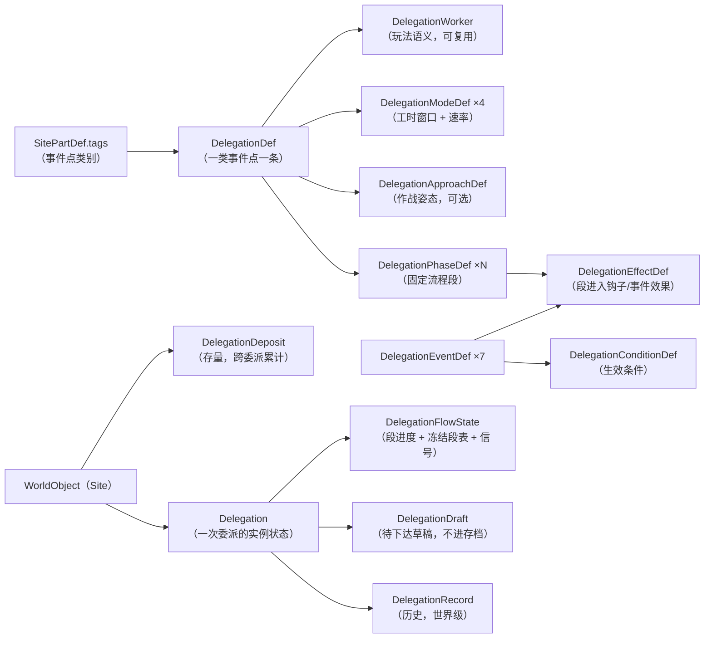
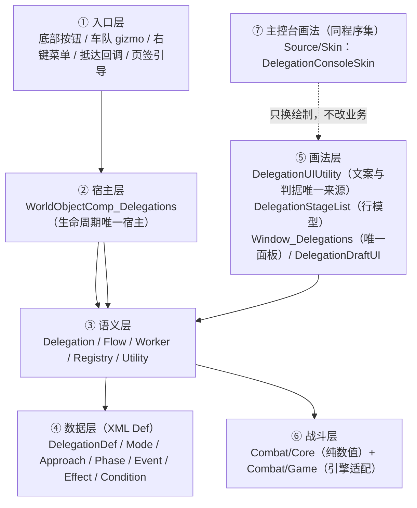
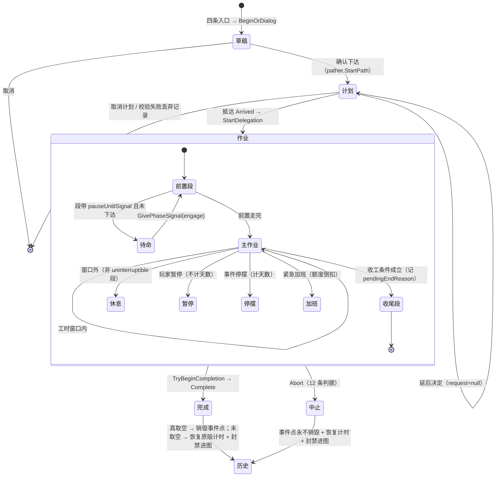

# 委派系统 · 设计文档（含需求基线）
### （Delegation System Design & Requirements · RimDelegation）

> **本文档的地位**：**两份文档中的第一份**（设计与需求侧，技术主文档）。
> **文档集（三份，各管一件事）**：
> - **本文** = 设计 + 需求基线 → 回答"系统是什么、由哪些抽象构成、**怎么再加一种事件点**、要做什么、怎么算做到了"；
> - `docs/委派系统-设计者文档.md` = 设计与操作指南 → 回答"**具体怎么改、改哪里、怎么验、炸了怎么查**"（给要动手的人）；
> - `docs/委派系统-现状审计与证据.md` = 审计 + 证据 → 回答"每一句结论凭什么、风险在哪、还有哪些未验证"（含《抽象采矿远征》初稿的差异对照表）。
> - 仓库根 `DESIGN.md`（5,666 行）是**按轮次的时间线日志**（S0→S34，含每轮用户原话与验收步骤）——**保留**，作为过程记录与决策出处，不再承担规范职责。
> **定位**：**采矿只是委派系统支持的一种事件点类别**，与搜刮、营救（以及将来的工作站点、废弃据点、小行星）平级。
> **标记约定**：`[已实现]` / `[部分]` / `[未实现]` / `[红线]`（不变量）/ `[待决]`。凡"绝对化结论"都附**前提路径**（这是本仓库踩过的坑：同一句结论在不同路径下可能不成立）。
> **结构**：**第一部分 §0–§12 = 设计**；**第二部分 §R-1–§R-8 = 需求与验收**。
> **时点**：设计正文的基线是 **2026-09-30**（源码 2026-09-28 20:08 / 本体 dll `FDAA3EE6…`）；**RIM-3 修订于 2026-10-05**。
>
> **RIM-3 修订（2026-10-05，用户拍板 5 问，原话见任务板 RIM-3 评论）**：原独立皮肤 mod「RimDelegation - Radius UI」
> **整体并入本体** —— ① 皮肤源码进 `Source/Skin/`，与本体**同一个 dll**（`RimDelegation.dll`）；
> ② `astryl.RadiusUI.Framework` 从"皮肤依赖"变成**本体硬依赖**（编译期强引用 + `modDependencies` 写死）；
> ③ 一键回退开关（皮肤总开关 / 标题栏「切回原版」）**移除**；④ `RimDelegation-RadiusUI\` 目录**删除**；
> ⑤ **双端 UI 准则作废**。本文所有"双端 / 皮肤 mod / 原版与皮肤各画一份"的表述已按新架构改写。
> 历史轮次（S0–S34）的原始记录保留在根 `DESIGN.md`，本文不再复述过程。

---

## 0. 一句话定位

> 委派系统把**世界地图上一个事件点上的作业**，交给一支远行队在**世界地图上**完成：不生成事件点地图、不手动操作，按游戏内时间推进、按载重交付、按流程分段、按风险决策。
>
> 事件点类别由 `SitePartDef.tags` 识别，**一个 `DelegationDef` 覆盖一类事件点**；新增一类事件点的目标是**只写 XML 不加代码**（需要新玩法语义时才加一个 `DelegationWorker` 子类）。

**已落地的事件点类别（5 条）**

| 事件点类别（tag） | 委派 Def | 玩法语义 | 代码 |
|---|---|---|---|
| `PreciousLump`（矿点） | `RimDelegation_MinePreciousLump` | 按采矿技能推进格数，产出直入车队 | `DelegationWorker_Mining` |
| `ItemStash`（物资藏匿点） | `RimDelegation_TakeItemStash` | 按负重预算搬运"件"，装满即收工留原地 | `DelegationWorker_TakeItemStash` |
| `PrisonerWillingToJoin`（囚犯） | `RimDelegation_RescuePrisoner` | 清场（强攻/潜入）→ 接人 → 入伙 | `DelegationWorker_RescuePawn` |
| `DownedRefugee`（难民） | `RimDelegation_RescueRefugee` | 清场 → 抬人 | 同上（不配姿态） |
| `WorkSite`（Ideology 工作站点，四种共用一条 tag） | `RimDelegation_ClearWorkSite` | 清场（**两批守军**）→ 搬空营地仓储 | `DelegationWorker_WorkSite`（继承 `_TakeItemStash`，只改速率/兜底/文案） |

依据：`Defs/RimDelegation_Delegations.xml:606 / 738 / 891 / 993 / 1076+`；运行期清单见 `Player.log`（每条 Def 的 worker 与 tag 逐条打印）。第五条见 §10.1 的落地说明。

---

## 1. 系统边界

### 1.1 做什么

- 把"到点 → 干活 → 装车 → 收工"抽象成世界地图上的时间推进。
- 保留全部决策：派谁、带什么、什么模式、多少产出算够、风险怎么担、什么时候撤。
- 复用原版一切可复用的东西：走路、消耗（吃/睡/药/病/心情）、负重、事件、编队、尸骸处理。

### 1.2 不做什么（红线，别在后续事件点里破）

| 不做 | 原因 |
|---|---|
| 不生成事件点地图 | 生成地图会停掉原版 30 天失效计时，也失去本系统的全部意义 |
| 不凭空生成矿物/物资 | 产出必须来自"事件点存量"或"现场实物"，且受载重限制 |
| 不代驾返程 | 收工后不接管 pather（回程由玩家决定） |
| 不替换原版扫描仪/任务生成 | 只**读**它们的产物 |
| 不为玩法在 `Delegation` 上加专用字段 | 只给"worker 语义"通用槽位（见 §6.1），否则状态类会随玩法数量膨胀 |
| 不给事件点"凭空加规模"除非玩法允许 | `AllowsScaleIncrease` 默认 false：规模是掷定抽象量（采矿）才允许被事件放大；现场实物类放大 ⇒ 进度永远追不上总量 ⇒ 死循环 |

### 1.3 与其他系统的关系

- **原版矿点/任务链**：上游，只读其存档产物（如 `SitePartParams.preciousLumpResources`）。
- **RimOre**（同工作区，选矿冶金链）：互补、零耦合；委派产出可以是它的矿石 Def。
- **Radius UI Framework**（workshop `astryl.RadiusUI.Framework`）：主控台绘制所依赖的第三方 UI 框架。RIM-3 起是**本体硬依赖**（编译期强引用 + `modDependencies`）；皮肤代码已并入本体 `Source/Skin/`（命名空间仍为 `RimDelegationRadiusUI`）。

---

## 2. 概念模型



| 术语 | 含义 | 载体 |
|---|---|---|
| **事件点** | 世界地图上的 `Site` 类世界对象（含 `SpaceSite` / `ClaimableSite` / `ClaimableSpaceSite` / `Mechhive`） | `WorldObject` |
| **事件点类别** | 由 `SitePartDef.tags` 或精确 `SitePartDef` 识别 | `DelegationDef.targetSitePartTags/targetSitePartDefs` |
| **委派（Delegation）** | 一次作业的实例状态，挂在事件点上（因为被消耗的稀缺资源是事件点本身） | `Delegation` |
| **存量（Deposit）** | 该事件点还剩多少、被委派过几次；**跨多次委派累计** | `DelegationDeposit` |
| **作业者（Worker）** | 这门活"是什么、怎么算进度、完成后给什么" | `DelegationWorker` 子类 |
| **模式（Mode）** | 工时窗口 + 速率乘数（轻松/常规/加班/全天候） | `DelegationModeDef` |
| **姿态（Approach）** | 作战轴向（强攻/潜入），只有需要清场的玩法配 | `DelegationApproachDef` |
| **流程段（Phase）** | 前置/收尾的固定时长段，线性、可带条件、可带钩子 | `DelegationPhaseDef` |
| **原语** | 可复用的效果与条件（8 + 9 个），让事件与段只写 XML | `DelegationEffectDef` / `DelegationConditionDef` |
| **草稿** | 待下达的表单（**刻意不进存档**：读档即作废） | `DelegationDraft` / `RimDelegationDrafts` |
| **在途计划** | "前往中"那一档（已决定 / 延后决定） | `WorldObjectComp_Delegations.planned*` |
| **留痕** | 已发生的随机事件与段结果（FIFO 上限 50） | `Delegation.eventLog` |
| **历史** | 世界级的完成/中止记录（上限 60） | `RimDelegationHistory.records` |

---

## 3. 架构分层与依赖方向



### 3.1 分层职责（每层一句话）

| 层 | 职责 | 规模（行） |
|---|---|---|
| ① 入口层 | 把 8 个玩家入口收敛到**同一个面板**；下达委派只有一个落点 `DelegationDraft.BeginOrDialog` | 1,131 |
| ② 宿主层 | 唯一宿主 `WorldObjectComp_Delegations`：生命周期、暂停/停摆/加班、封锁进图、随机事件、小时交付、完成/中止 | 2,414 + 周边 811 |
| ③ 语义层 | 状态（`Delegation`）、段机（`DelegationFlow`）、玩法（`DelegationWorker` ×4）、索引（`DelegationRegistry`）、工具与文案判据 | 6,386 |
| ④ 数据层 | 7 类 Def，全部可 XML 配（段/事件/效果/条件/模式/姿态/委派） | 2,410 |
| ⑤ 画法层 | "画什么"（UIUtility + StageList）与"怎么画"（Radius UI 皮肤）分离 | 5,683 |
| ⑥ 战斗层 | `CombatSimulator.Simulate(CombatScene, IRng)` 纯数值；`Combat/Game` 负责把真 pawn/事件点折成快照 | 3,655 |
| ⑦ 主控台画法 | `Source/Skin/`（**同一程序集**）：`Window_Delegations.DoWindowContents` 直接调 `DelegationConsoleSkin.Draw`；**零 Harmony 补丁** | 4,481 |

### 3.2 [红线] 层间不变量

1. **文案与判据只有一份**：玩家可见的每个词都从 `DelegationUIUtility` 取；结束条件句子只有 `EndConditionLabel` 一份。
2. **行模型不含画法**：`DelegationStageList` 只输出 `DelegationStageRow(kind/text/frac/iconAt)`，主控台皮肤渲染的就是这一份 ⇒ 数据与画法天然不会说两件事（RIM-3 后不再有"第二端"）。
3. **共用件复用而不是新造**：进度条用"同一页面已有"的画法（现为皮肤的 `UIKit.Flat.Bar`；`Widgets.FillableBar` 只留在旧对话框与**原版兜底**的报告画法里）。
4. **面板只许有一个**：新增玩家可见区块前先问"能不能只是主控台的一个入口/一页"。
5. **皮肤与本体同程序集、依赖单向**：皮肤只读本体的公开件（`DelegationUIUtility.*` / `RimDelegationDrafts` / `RimDelegationHistory` / `WorldObjectComp_Delegations.*`），**绝不重写逻辑、也不另存第二份文案或判据**；唯一的接点是 `Window_Delegations.DoWindowContents` 调 `DelegationConsoleSkin.Draw`。⚠️ RIM-3 之前的"本体零依赖皮肤、删掉皮肤照常运行"**已作废**：现在皮肤就是主控台唯一的画法，`astryl.RadiusUI.Framework` 是硬依赖。

### 3.3 宿主的能力边界（改之前必读）

- 每个事件点**同时只允许一次在途委派**（`active` 单值）+ 一份在途计划（`planned*`）。
- 「此刻算不算在干活」**只有一个判据** `Delegation.IsWorkTime(site, nowAbs)`（含紧急加班与"等玩家指令"两条例外），共 11 个读取点。
- 收工/中止**只有两个出口** `Complete` / `Abort`（前者仅由 `TryBeginCompletion` 与 DEV 调用）。
- 没有任何 UI 代码直接调 `Complete`。

---

## 4. 生命周期与状态机

### 4.1 七态



**依据**：入口 `DelegationDraft.cs:207`；抵达 `CaravanArrivalAction_StartDelegation.cs:75/107`；开工 `WorldObjectComp_Delegations.cs:858`；每 tick `:946`；收尾入口 `:1319`；两个出口 `:1502 / :1562`。

### 4.2 开工时必须完成的 6 件事（顺序有意义）

1. 前置校验（参与者、模式、Def、事件点存活）
2. **存量闸门**：剩余量为 0 ⇒ 拒绝开工（否则委派与事件点永久卡死）
3. 掷定/复用存量（**只在事件点上掷一次**，之后永远复用）
4. `new Delegation(...)` → `worker.OnStart`（解析矿种/清单/目标人）
5. **抄台账**（"已获取 X/Y"里的分母）
6. **冻结本次生效的段表**（有敌情/无威胁两岔在**这一刻**定下来，之后按冻结结果走到底）

依据：`:858-940`（校验 `:860-881`、闸门 `:896`、`new` `:903`、台账 `:907`、冻结 `:912`）。

### 4.3 每 tick 的判定顺序（宿主 `TickDelegation:946`）

```
事件点存活 → 封锁续期 → 段旁白 → 车队存活/未进图/未离格 → 断粮 → 人力重算
→ worker 的"干不下去"判据 → 暂停 → 停摆 → 每日心情
→ 收尾分支 → 结束条件(按天数/配额) → [红线]工时门控 → 段进入钩子 → 前置段推进
→ worker.Tick（产出）→ 随机事件(1h) → 交付(1h) → 取空/worker 收工判据/结束条件 → TryBeginCompletion
```

---

## 5. 扩展点总表（**本章是"支持更多事件点"的操作手册**）

### 5.1 加一类新事件点：最小路径

**只有 3 种情况会需要写代码**，其余全部是 XML：

| 情况 | 需要写的代码 |
|---|---|
| A. 玩法语义与现有 worker **同类**（例如又一种"按技能推进、产出直入车队"的采矿类事件点） | **零代码**：只加 `DelegationDef` XML |
| B. 玩法语义不同，但**能复用现有原语**（进度按时间推进、装车按载重） | 一个 `DelegationWorker` 子类（参考 `DelegationWorker_Mining.cs` 455 行） |
| C. 需要新的段内动作或触发条件 | 一个 `DelegationEffectDef` 或 `DelegationConditionDef` 子类 |
| D. 事件点**不是 `Site`**（例：小行星 `MapParent`） | 宿主泛化（结构性改动，见 §10.3） |

### 5.2 新增事件点检查清单（照着走，含静默失败点）

1. **查 tag**：目标事件点的 `SitePartDef.tags` 是什么（`rimsearcher get <name> --type SitePartDef --field tags`）。⚠️ rimsearcher **不含自家 mod**，自家 Def 只能读 XML。
2. **回答三个数据问题**（决定能不能不解图）：
   - 存量/规模从哪读？优先**存档里的 `SitePartParams` 字段**（已 `Scribe_Defs`）；
   - 现场实物在哪？`SitePart.things` / 专用 comp；
   - **读不到怎么办**？两条合法出路：① 该类别不适合委派 ⇒ `ForbidAbstract`（给玩家一句明确理由）；② 按原版同一 maker **提前掷定并写回事件点**（如搜刮的做法），且必须在玩家可见处说明"这份清单是委派提前掷的"。⚠️ **注意前提路径**：任务的"建点时清单已存在"只对**任务生成路径**成立，非任务生成的事件点要等生成地图时才掷——所以"读不到"必须与"没有"分开处理。
3. **写 `DelegationDef` XML**：`workerClass` / `targetSitePartTags` / 中英 label 与信件 / `modes`（默认沿用 4 档）/ `approaches`（仅需清场时）/ `flowPhases`（要固定流程时）/ `blockMapEntryAfterWorked` / `destroyTargetOnComplete` / `skillDef` / 心情 / `emergencyOvertime*`。
4. **需要新玩法就写 worker 子类**（§5.3 分组覆写）。
5. **需要新段就加 `DelegationPhaseDef`**（纯 XML，17 个字段见 §11.2）。
6. **需要新动作/条件就写原语子类**（§5.4）。
7. **确认宿主已挂上**：`Site` 类 5 个 def 已由 patch 挂好；**新增的 `WorldObjectDef` 类型必须同时改** patch 的 xpath 与 `ModBoot.SiteLikeWorldObjectDefs` 自检名单（两处手写清单，**必须同步**）。
8. **补自检**：把这门活的静默失败点加进 `ModBoot`（例：清单门控指向不存在的段、等信号却没段揭露情报、收集段排在交战段之前、开了加班却没配心情）。
9. **校验**：改过 XML 必跑 `tools\Check-DefsXml.ps1`（注释里两个连续减号 ⇒ 整份静默失效）。
10. **构建 → 部署 → 看日志**：`[RimDelegation] 已加载 | … | DelegationDef N 个` 的 N 要 +1，且清单行出现新 def 与正确 tag。
11. **验收**：就地 + 预先两条入口、有敌情 + 无威胁两岔（若配了条件段）、完成 + 中止两条出口、中途存读档各一次。

### 5.3 `DelegationWorker` 的 30 个虚方法（**全部有默认实现，没有一个是"必须覆写"**）

按用途分组，括号里是"不覆写会发生什么"：

**A. 量纲与文案（不覆写 ⇒ 显示采矿口径）**
`UnitName`（"格"）· `WorkVerb`（"采"）· `ActivityName`（"开采"）· `OutputUnitName`（"单位"）· `UntilDepletedLabel`（"采空为止"）· `StatusKeySuffix`（"Mining"，用于远行队信息栏的 Keyed 后缀，缺键会退回基础键）
> ⚠️ **违反量纲契约的典型症状**：搜刮点写出"委派开采中""采空为止"。

**B. 结构不变量（不覆写 = 保守侧）**
`AllowsScaleIncrease`（false）：这门活的规模是不是"掷定的抽象量"，因而不怕被事件放大。

**C. 生命周期（不覆写 = 空实现）**
`OnStart` · `Tick(d, site, delta)` · `OnComplete` · `OnAbort`

**D. 判据（不覆写 = 永不因此收工/中止）**
`WorkerAbortReason`（干不下去）· `WorkerEndReason`（该收工了）· `DepletedReason`（干完的理由文案）

**E. 目标与台账（不覆写 = 没有预览/台账）**
`RollDeposit`（**只在事件点上掷一次**）· `MakePreview` / `PreviewLabel` / `PreviewItems`（抵达前"预期获得"）· `ProgressItems`（作业期"现场还剩什么"）

**F. 估算（不覆写 = 显示"无法估算"）**
`EstimatedUnitsPerDay` · `EstimateUnitsPerDayFor`（对话框用，避免为估算而建实例）· `EstimateUnavailableReason`（**算不出来的原因要说对**）

**G. 交互与文案**
`PawnDetail`（选人列表每人一行）· `GetGizmoIcon`（数据驱动图标，null 则退回 Def 的贴图路径）· `ProgressLabel` · `DeliverySummary`

**H. 姿态轴（只有需清场的玩法用）**
`ApproachForecast`（对话框底部成算）· `ApproachFirstStrikePenalty`（"守军先手"折扣，**必须与结算同源**，见 §8.5）

**I. 交付与说明**
`FlushDeliveries`（把待交付产出送进车队，返回实际数量）· `InspectWarning`（把"这门活的已知不精确之处"摊给玩家看）

**J. 静态工具** `StatusKey(baseKey, suffix)`：拼 Keyed 键并用 `Translator.CanTranslate` 兜底，**防玩家看到裸键名**。

### 5.4 原语：效果（8）与条件（9）

| 效果原语 | 用途 |
|---|---|
| `_Stall` | 作业停摆 N 小时（**照样消耗计划天数**＝事件的时间代价） |
| `_LoseOre` | 按比例损失已采 |
| `_GainScale` | 放大目标规模（**只有 `AllowsScaleIncrease` 为真才允许**） |
| `_Thought` | 挂心情记忆 |
| `_Damage` | 造成伤害（可按疲劳缩放） |
| `_Text` | 只出文字 |
| `_ResolveCombat` | **段进入钩子**：跑一次无地图战斗结算 |
| `_GainLoot` | 把缴获按载重闸门装车（**必须排在交战段之后**） |

| 条件原语 | 用途 |
|---|---|
| `_OreUnitsAtLeast` / `_DepositNotDepleted` / `_ScaleIncreaseAllowed` | 存量类 |
| `_ParticipantsAliveGreaterThan` / `_AnyAbleParticipant` | 人力类 |
| `_HasThreat` / `_NoThreat` / `_DefIs` | 环境/自省类 |
| `_FatigueMultiplier` | 动态倍率（把疲劳接进事件概率） |

### 5.5 宿主扩展点（原版覆写，共 6 个）

`CompTickInterval`（每 tick 校验计划 + 推进）· `GetCaravanGizmos`（**就地委派** + 作业期控制）· `GetFloatMenuOptions`（**预先委派**）· `GetGizmos`（事件点侧：中止 + DEV）· `CompInspectStringExtra`（检视文本）· `PostExposeData`（存档 + 读档自愈）。
⇒ **双入口靠这两个原版扩展点 + `CaravanArrivalAction`**；主控台绘制走**直接调用**，不占 Harmony 补丁点（见 §11.3）。

### 5.6 画法层扩展点

- 要加一句话/一行 → 改 `DelegationUIUtility`（文案与判据唯一来源）。
- 要在流程块加一种行 → 改 `DelegationStageList`（行模型），**皮肤自动跟上**（RIM-3 起只有一端）。
- 要在草稿表单加一格 → 改 `DelegationDraftUI`。
- 要改**委派报告**（收工时那个签核窗口 = 主控台右栏的「历史详情」）→ 改 `Source/Skin/ReportSkin.cs`
  一处，两个入口同时跟上（RIM-9）；原版画法的 `DelegationReportUI` 只在皮肤不可用时兜底。
- 两趟量高是唯一允许的测高方式（`DetailPass(view=null)` 量高 / 传矩形绘制），**不得**用 `Event.current.type == Layout`。

---

## 6. 数据模型与存档契约

### 6.1 `Delegation`：为什么只有"通用槽位"

设计意图：**不为每种玩法加字段**，只给 4 个由 worker 定义语义的槽位 —— `resourceDef` / `rolledValue` / `totalCells` / `workerStage`，再加 `workerAbortReason` / `extractionReport` 两个说明字段。
代价（必须知道）：`rolledValue` 是复用的（采矿=规模值、搜刮=已搬 kg、营救=战斗种子）⇒ **将来若某个 worker 同时需要两种语义会互相覆盖**。

其余字段分组：定义引用（def/mode/approach）· 参与者与车队（引用）· 台账（Deep）· 进度（cellsMined/ticksWorked/ticksResting/haulCarryOverKg）· 结束条件（三选一 + 天数/配额 + 断粮是否中止）· 产出（oreUnits 待交付小数 / oreDelivered）· 暂停与停摆 · 流程（`flow` Deep + 中止理由 + 交战摘要 + 待公布结果）· 战果（缴获/清点账/待搬尸体/尸骸数/俘虏）· 加班额度 · 事件（冷却两条平行列表 + 留痕 Deep）。
**不进存档**：`deposit`（事件点持有，读档重挂）· `threatSummary`（可重算）· `worker`（懒建）。

### 6.2 存档契约 [红线]

1. **标签统一前缀**（`ro`）：原版把 `WorldObject` 上**所有 comp 的字段平铺在同一层 XML**，曾用 `active` 撞上别的 comp 的 bool 导致解析异常。
2. **读档自愈**：`mode` 被改名 ⇒ 退回该 Def 的默认模式；台账缺失 ⇒ UI 退回旧写法（**不显示假 0**）；`flow` 缺失 ⇒ 兜一个空状态；冻结段表缺失 ⇒ 退回 Def 全段；两条平行列表长度不一致 ⇒ 补长对齐；已玩过的事件点 ⇒ 补封禁进图。
3. **一次性动作必须落盘**：段进入钩子（交战会真打一场）靠 `flow.enteredPhase` 保证"恰好一次"，否则读档重跑＝白送一场战斗。
4. **待搬清单搬完必须清空**：`lootBag` / `pendingCorpses` 都是深存档（尸体还裹着 pawn 的完整状态），不清空就能靠读档反复刷战利品。
5. ⚠️ **当前阻断项**：三个 `GameComponent`（历史 / 草稿 / 车队解锁）缺 `(Game)` 构造函数 ⇒ 读档丢弃历史记录与车队解锁名单。反编译已定论：`Verse.Game.FillComponents()` 是 `Activator.CreateInstance(type, this)`，**子类必须有 `(Game)` 构造**。不修则本节第 2/3 条对这两个组件不成立。

---

## 7. 三条玩法如何落在同一套抽象上（框架 vs 特例的实证）

| 抽象槽位 | 采矿 | 搜刮 | 营救 |
|---|---|---|---|
| `UnitName` / `WorkVerb` / `ActivityName` / `OutputUnitName` | 格 / 采 / 开采 / 单位 | 件 / 搬 / 搜刮 / 件 | 点 / 救 / 营救 / 人 |
| 目标解析 | 读 `SitePartParams.preciousLumpResources` | `SitePart.things` → 专用 comp；读不到就按原版 maker **提前掷定并写回** | 目标人归一（两级优先级 + 现生成） |
| `RollDeposit` | 总值 → 格数、单格产出 | 件数 / 总 kg | 目标是否存在（1/0） |
| 进度轴 | `cellsMined`（格，小数） | `cellsMined`（件） | `cellsMined`（百分点，上限 100） |
| 速率来源 | `19 × round(100/MiningSpeed)` | 负重预算 × 0.25 趟/小时 | `12 × 人数 × (0.6+0.04×技能)` |
| 交付 | 每小时 flush（`oreUnits` 缓冲） | **边搬边装车**（`FlushDeliveries` 恒 0） | 无产出交付（抬人＝完成） |
| 收工判据 | `TargetDepleted` | `WorkerEndReason`（车队装满，地点保留） | 抬到人 ⇒ 完成；清场失败 ⇒ `workerAbortReason` ⇒ 中止 |
| 姿态轴 | 不配 | 不配 | 强攻 / 潜入 |
| 用的记录字段 | `workerStage` 不用 | `haulCarryOverKg`（跨 tick 搬运预算余数） | `workerStage` 5 档、`rolledValue`＝战斗种子 |
| 流程段 | 7 段（含两岔） | 4 段（侦察/移动/破门/撤离） | 不配（就地结算） |

⇒ **结论**：新增事件点的真实成本取决于"它能不能塞进这 12 行表格里已有的槽位"。填不进去的那一格，才需要新代码。

---

## 8. 关键机制的不变量 [红线]

1. **唯一出口**：收工/中止只有两个方法；新增任何路径都不许绕过（否则"再来一封信 + 再记一条历史 + 再排一次报告"）。
2. **单一工时判据**：`IsWorkTime` 只有一处定义；判据曾散在四处，漏一处就出现"界面说在加班、休息条却回升"这种半真半假状态。
3. **存量挂事件点**：`totalCells` 是"本次开工时抓的快照"，`deposit.unitsMined` 才是跨委派累计 —— 事件放大规模时必须同步加 `totalCells`，否则进度永远追不上。
4. **冻结段表**：段表随状态变化会让下标指到别的段，而存档只有下标、无从纠正 ⇒ 条件只在开工那一刻判一次。
5. **预告即契约**：预告与结算跑同一引擎、同一份战场快照。⚠️ **前提**：这条只对**引擎**成立；折扣这类**输入**必须同源 —— 当前"守军先手一轮"有 4 处算法点（2 处带 `stealth`、2 处不带），已产生"主列 1.0 / 对话框 0 / 结算 0"的三方矛盾，**属必修**。
6. **封锁进图**：动过存量的事件点不许再走原版进图（防双吃，也是玩法口径）；用原版冷却组件实现、只撤自己起的那次、读档补对齐。
7. **0 存量闸门**：剩余为 0 拒绝开工。
8. **不静默蒸发**：任何战果都要有归宿或至少一行说明；"被打死/被打倒"必须同一归宿。
9. **画法唯一、判据唯一**：主控台只有 Radius UI 一种画法（RIM-3 后"双端同一份"**作废**）；玩家可见的判据与公式仍只有一份，来自 `DelegationUIUtility` 与 `DelegationStageList`。
10. **文案唯一来源 + 世界观内措辞**：禁"生成地图/掷定/GenStep/SitePart/组件名/Def"这类引擎词。
11. **条目齐 > 条目精**：值拿不到写「未知」，不假 0、不让那一行消失。
12. **静默失败必须喊出来**：Def 配漏、patch 没命中、组件没注册，都要在启动自检或日志里出现。

---

## 9. 风险与已知偏差（摘要，详见 `docs/委派系统-现状审计与证据.md`）

| 等级 | 项 |
|---|---|
| P0 | 三个 `GameComponent` 缺 `(Game)` 构造（读档丢历史与车队解锁名单，已实证） |
| P0 | 「守军先手」折扣 4 处口径分裂（主列/对话框/结算/车队侧互不一致）；`ThreatAssessmentEntry.Open` 缺"不参战"名单形参 ⇒ 该勾选对营救清场无效 |
| ~~P0~~ | ~~无版本控制（四个目录都无 git）~~ ⇒ **已缓解**：RIM-2 建了本地 git（`0dad4fc`）；远程推送仍待做 |
| P1 | 离线战斗验证工程（Prototype/CombatLab）因纯数值层引入 `ThingDef` 而编不动 ⇒ 无游戏外回归手段 |
| P1 | 计划"只加 XML"的泛化承诺尚未被验证（下一种事件点是第一次真考验） |
| P2 | 多威胁部件时 `enemyIndex` 串台 + 真 pawn 泄漏；伤害尺子只在 `healthScale≈1` 成立；猎杀人类编队不吃种子 |
| P2 | 脆弱接点：private 方法补丁、原版文案字符串匹配、反射 private 字段 |
| P3 | 9 个孤儿语言 key、`Defs` 无 `DefInjected`、主控台每帧分配（RIM-3 已消掉"皮肤 README/About.xml 文档漂移"这一项：皮肤目录整个删除） |

---

## 10. 路线图：后续要支持的事件点

### 10.1 直接可加（预计零代码或被现有 worker 覆盖）

| 事件点 | 数据可得性 | 备注 |
|---|---|---|
| ✅ **已落地（2026-09-30）：Ideology 工作站点 `WorkSite_*`** | `SitePart.things`（**建点那刻**由 `SitePartWorker_WorkSite.Init` 掷好并 Deep 存档） | 见下方"§10.1.1 工作站落地说明" |
| 废弃据点 / 古代仓库 / `OpportunitySite_*` | 视具体 part（Odyssey 那批 `lootTable` 实测**全为 null**） | 需逐个反编译定位存量来源 |
| 哨所（Outpost） | 战利品市值**就在存档**（`SitePartParams.lootMarketValue`） | 属"收集任务"侧，见 §10.4 |

#### §10.1.1 工作站落地说明（2026-09-30，用户六问答复：工作站 / 乙档清场+搬运 / 按 tag / 速率 0.5 / 掉派系好感 / 追加进本文档）

**为什么它一开始就能"少代码"**（全部第一手反编译）：

1. `Site.AddPart` 的最后一行是 `part.def.Worker.Init(this, part)` ⇒ `SitePartWorker_WorkSite.Init` 在**建点那一刻**就按权重掷出一种 loot、用 `ThingMaker.MakeThing` 造出实物塞进 `SitePart.things`（`ThingOwner<Thing>`，`dontTickContents = true`），并把 `lootThings` / `expectedEnemyCount` 一起写好；`SitePart.ExposeData` 用 `Scribe_Deep` 把 `things` 存档 ⇒ **不解图就能读到，且抵达前就是精确值**。
2. 进图时 `GenStep_WorkSiteStash.ScatterAt` 优先拿**同一份** `sitePart.things` 当 `stockpileConcreteContents`；只有它空/无时才按 `site.workSitePoints` **另掷一份** ⇒ `blockMapEntryAfterWorked` 与 `destroyTargetOnComplete` 都是必须的（与搜刮点同一条理由）。
3. 市价算法（照录，注意**同一曲线连求两次**）：`x = PointsMarketValue.Evaluate(parms.threatPoints)` → `num = PointsMarketValue.Evaluate(x)` → 件数 `= ceil(num / BaseMarketValue)`。曲线 `(100,200)(250,450)(800,2000)(10000,5000)`；威胁点数 350 时 ≈ **1807.8 银**，即伐木点 ≈ 1507 根 WoodLog（MV 1.2 / Mass 0.4 / 堆叠 75）≈ **603 kg**。
4. 四个工作站（`WorkSite_Logging` / `_Hunting` / `_Farming` / `_Mining`）**共用一条 tag `WorkSite`** ⇒ 一条 `DelegationDef` 全覆盖（宽口径，代价是第三方复用该 tag 也会被接管；要收窄就换 `targetSitePartDefs` 精确列四条）。

**这一轮实际改了什么**（4 个文件 + 1 条 XML）：

| 文件 | 改动 | 为什么 |
|---|---|---|
| `Source/Combat/Game/ThreatRosterFactory.cs` | `SupportOf` 加 4 个 case；`Build` 加分支；新增 `GenerateWorkSiteGuards`；`GeneratePawnGroup` 参数化 `points` / `fightersOnly`；**并把敌人下标从局部计数器改成全局 `r.Enemies.Count`** | 之前它们落进 `Unsupported` ⇒ `CanAssess = false` ⇒ 一进交战段就 Abort。下标那条同时修掉了审计 §12-N 的"第二个威胁部件覆盖 `EnemyPawns[0..n]` 并泄漏真 pawn / 缴获记错敌人" |
| `Source/DelegationWorker_WorkSite.cs`（新增） | 继承 `_TakeItemStash`，只改三件事：`TripsPerWorkHour = 0.5`、`RollDeposit` **不兜底现掷**（营地没有"等进图才掷"这回事，兜底会凭空造物）、营地口径文案 + `InspectWarning` | 用户拍板的速率档；防凭空生成 |
| `Source/DelegationWorker_TakeItemStash.cs` | 把速率提成 `virtual float TripsPerWorkHour`（常量 `HaulTripsPerWorkHour = 0.25` 保持不动，它是"7×7 密室"那一档的事实规格），静态工具加可选形参 | 用户拍板"新开 0.5" |
| `Source/DelegationUtility.cs` | 新增 `ApplyCombatGoodwill`：对每个被打死/打倒的敌人调**原版自己的** `Faction.Notify_MemberTookDamage`，伤害量按本模型耐久损失折算 | 用户拍板"掉派系好感"。**为什么不走 `Pawn.Kill → Notify_MemberDied`**：后者的好感分支被 `map != null && map.IsPlayerHome` 卡死，而抽象战斗没有地图（这条对**全部**委派的清场生效，不只工作站） |
| `Source/ModBoot.cs` | 新增 `CheckTargetTags()`：某条委派要的 `targetSitePartTags` 在 Def 库里一个件都匹配不上就 Warning | 拼错一个标签（`Worksite`）的症状是"这条委派永远不出现"，纯静默失败 |
| `Defs/RimDelegation_Delegations.xml` | 新增 7 条 `DelegationPhaseDef`（外围侦察/观察营地/战斗评估/交战/搜集战利品/就地扎营/撤离）+ 1 条 `DelegationDef`（`RimDelegation_ClearWorkSite`） | 纯 XML，零 C# |

**已知近似（必须让玩家看见，已写进 `InspectWarning`）**：抽象战斗不逐发子弹结算，好感按"每个敌人一次伤害事件"折算（原版算式把单次伤害封顶 100，而打死一个人的累计伤害也就 100 上下 ⇒ 一次与多次同值）；**打输撤退那条路不结算好感**（原版会扣）。

### 10.2 需要新 worker

- 需要"就地干活产出实物"的类别（伐木/狩猎/耕作）—— 语义接近采矿但产出与技能尺子不同。
- 需要"清场但不接人"的类别 —— 语义接近营救清场。

### 10.3 需要宿主泛化（结构性）

`WorldObjectComp_Delegations` 当前 `Site Site => parent as Site`。**小行星采矿点不是 `Site`**（`ResourceAsteroidMapParent`）⇒ 要支持它必须把宿主从 `Site` 泛化到 `MapParent`（涉及：存量挂载、封锁进图、30 天计时、所有把 `Site` 当参数的签名）。这是本系统目前**最大的一处结构性改动**。

### 10.4「收集任务」侧的战利品（口径已定、未实装）

用户口径：**哨所/工作站点/事件点自带的战利品属于「收集任务」那一组**，与"缴获敌方装备"分开。数据源三条已查证：哨所＝`SitePartParams.lootMarketValue`（进图时由 `GenStep_Outpost` 交给 BaseGen 撒出）、工作点＝`SitePartDef.lootTable`（唯一读取点 `SitePartWorker_WorkSite.LootThings`）、事件点自带实物＝`SitePart.things`。

### 10.5 系统能力缺口（与事件点无关，但影响"再加一类"的成本）

段耗时 × 技能因子 · 「评估段」的段内入口 · 数据驱动的 worker（`DelegationWorker_DataDriven`，目标：让第三方 mod 不改代码就能接进来）· 风险三档预设 · 自动返回/召回 · 效率全局倍率 · 协作惩罚 · `DefInjected` 英文。

---

## 11. 附录

### 11.1 关键 Def 字段字典（简表）

| Def | 关键字段 |
|---|---|
| `DelegationDef` | workerClass · targetSitePartTags/targetSitePartDefs · commandLabel/Desc · planning* · 三组信件文案 · min/maxPawns · skillDef · modes+defaultMode · approaches+defaultApproach · handleTargetTimeout · destroyTargetOnComplete · abortIfCaravanLeavesTile · casualtiesArePermanent · blockMapEntryAfterWorked/Days · 三组心情 · defaultEndCondition · maxDaysLimit · flowPhases · workSquadPosition · hideItemsUntilPhase · 主作业段旁白四池 + 重掷间隔 + speakerMode · restAmbientLines · emergencyOvertimeHoursPerUse/MoodThought · gizmoIconPath |
| `DelegationPhaseDef` | hours · afterWork · progressLabel(+Group) · ambientLines(+Solo/Packed/Hostile) · ambientRerollHours · uninterruptible · squadPosition · skillDef · requireThreat/requireNoThreat · revealsThreat · pauseUntilSignal · flowCategory · deferNoteUntilDone · onEnter[] · speakerMode |
| `DelegationModeDef` | startHour · endHour · **workIntensity**（RIM-5）· abortWhenOutOfFood —— ⚠️ `workRateMultiplier` 与 `dailyMoodThought` 自 RIM-5 起**不再被读取**（字段保留仅为第三方 patch 不报未知字段；ModBoot 会喊） |
| `DelegationSatisfactionDef` | thought · mealRecentDays · travelGraceDays · travelFullPenaltyDays · intensitySpan · efficiencyRange · moodScale · sources[]（source / enabled / weight）—— RIM-5 满意度的曲线与默认权重 |
| `DelegationApproachDef` | stealth · skillDefs · baseExposure · exposurePerGuard · exposureReductionPerExtraPawn · exposureReductionPerSkillLevel · min/maxExposure · guardsGetFirstStrike · firstStrikeFactor |
| `DelegationEventDef` | severity · mtbDays · minDaysBetween · weight · letterDef · conditions[] · chanceMultipliers[] · effects[] · flavorLines[] · onlyForDelegationDefs[] |
| `DelegationFoodMoodDef` | thought · defaultStage · entries[]（按 tasteThought 或 preferability 映射 stage） |

### 11.2 反编译核实过、可直接引用的引擎事实

1. `Verse.Game.FillComponents()` = `Activator.CreateInstance(type, this)` ⇒ **`GameComponent` 子类必须有 `(Game)` 构造函数**；`Verse.GameComponent` 自身只有 `protected` 无参构造。
2. `MainButtonWorker.DoButton` 的 `Disabled` 早退发生在画图标之前 ⇒ 按钮置灰时**不画图标**（角标要自己画）。
3. `EnterCooldownComp`：`Start(Nullable<float>)` / `Stop()` / `BlocksEntering` / `DaysLeft` / `TicksLeft`；原版 `PostMapGenerate` 会自己 `Stop()` ⇒ 用它做"进行中封锁"必须短窗口续期。
4. `QuestPart_WorldObjectTimeout → QuestPart_Delay → QuestPartActivable`，后者有 private 字段 `state`（恢复原版 30 天计时的反射目标）。
5. 世界地图右键菜单只在一支车队被唯一选中时存在 ⇒ 右键事件点的委派菜单**天然带车队语境**。
6. 世界地图侧**没有实时天气**（`WorldWeather` 0 命中、`WeatherManager` 只挂 `Map`）⇒ "正在下雨"类台词**无数据源**，只能做温度/全球事件近似。

### 11.3 构建 / 部署 / 核查（改动后必走）

1. 编译用完整 MSBuild（net472，**不能用 `dotnet build`**）：RIM-3 后只剩**一个工程**（`Source/RimDelegation.csproj`，`**\*.cs` 自动带上 `Source/Skin/`），一条 `build.ps1` 出单一 dll。引用表新增 `RadiusUI.Framework`（`<Private>False</Private>`，绝不随包复制）。
2. 改过 XML 必跑 `tools\Check-DefsXml.ps1`（注释里两个连续减号 ⇒ 整份静默失效）。
3. 部署前**退出游戏**（dll 被锁会被预检挡下）；只认脚本打印的 SHA256 自检行。
4. 生效判据：`Player.log` 的 `[RimDelegation] 已加载 | … | DelegationDef N 个 | … | 主控台画法 Radius UI 皮肤` + Def 清单行。RIM-3 后**没有第二个加载横幅**（`[RimDelegation-RadiusUI] 已加载` 不再出现——它不再是独立 mod）；皮肤日志统一带 `[RimDelegation] 皮肤：` 前缀。
5. 部署脚本只有本体那一份 `deploy.ps1`（robocopy `/MIR` + `ERROR` 静默失败检测 + 进程预检 + dll SHA256 自检）——RIM-3 删皮肤目录时，那份"没有 ERROR 检测"的脚本一并消失。
6. ⚠️ 部署前还要确认 `ModsConfig.xml` 里**不再有** `duskmelon.rimdelegation.radiusui`（旧皮肤 mod 的 id）；留着它会让游戏在启动时报"缺少 mod"。

---

## 12. 待决项

⇒ 完整 **12 条**（含我的建议）见**第二部分 §R-7**；本处不再重复，以免两处漂移。

---
---

# 第二部分 · 需求与验收

> 本部分回答"要做什么、怎么算做到了"。**设计事实在第一部分**；每条需求只给验收判据要点与对应章节，不重复推导。
> 标记：`[基线]`＝已实现且有判据；`[缺口]`＝初稿提出或系统能力缺失、当前未实现（收进 §R-6）；`[待决]`＝需要拍板（§R-7）。

## R-1 功能需求清单（FR-1 ~ FR-14）`[基线]`

| # | 需求（一句话） | 验收判据要点 | 设计依据 |
|---|---|---|---|
| **FR-1** | 任务创建与下达：事件点上有匹配 Def 时提供入口；四条下达路径收敛到同一草稿；支持延后决定与成员/模式/姿态/结束条件选择；剩余量为 0 时拒绝开工 | 就地 gizmo 与右键菜单都出现；`legacyDelegationDialog=false` 时三条路径都进「待下达」；延后决定存读档不丢；0 存量开工被拒 | §5.1 §5.5 §4.2 |
| **FR-2** | 目标识别与存量：按 `SitePart` 标签或精确 Def 匹配；不解图即可拿到存量；存量挂事件点、跨委派累计；只掷一次并持久化；抵达前给范围、抵达后给精确值 | 换 tag 能识别；「中止→重委派」不刷新存量；预览与精确值分别出现在两个阶段 | §5.2 §6.1 |
| **FR-3** | 效率模型：由原版数值链驱动；技能同时影响"多久一格"与"一格产出"；多人逐人叠加；模式提供 4 档工时与倍率；推进量对本次可采量封顶；给出 ETA 与"算不出的真正原因" | §6 三条公式逐条可核；改 XML 倍率存盘即生效；`cellsMined` 不超过 `totalCells` | §5.3 A/F §6.1–6.3 |
| **FR-4** | 产出与交付：不生成在任何地图；每小时 + 收工/中止各交付一次；负重真实生效；满载给可执行选择；装车按值钱先装 | 车队库存里能看到产出；中止后已采部分在车上；满载收工后事件点与余料都在 | §7 交付行 |
| **FR-5** | 时间、消耗与工时：吃喝睡药病复用原版；工时窗口按模式生效；不可打断的固定段；暂停不计天数、停摆计天数；紧急加班且惩罚按事件点累计递进；三种结束条件且作业期可改 | 窗口外不产出且显示"休息中"；加班时休息条不回升；同一地点第 n 次加班挂第 n 级心情 | §4.3 §6 |
| **FR-6** | 风险与战斗：随机事件可整开关、每条各自 MTB/冷却/权重/条件/效果；效果走原语；威胁基于存档守军数据；无地图结算且预告与结算同引擎；编队用原版种子复现、无法抽象的明确拒绝；阵亡真实；战果有归宿 | 事件只进留痕（零弹出）；无法抽象的事件点给明确理由而非假成算；同种子同战场逐字段一致（**引擎层**成立，**输入层**见 §8.5） | §5.4 §8.5 |
| **FR-7** | 固定流程段：前置/主作业/收尾；段支持不可打断、等信号、延后公布、进入钩子；条件两岔在开工时冻结；清单门控；旁白四池 + 总开关；前置段真耗时 | 加一段只写 XML；有敌情与无威胁走不同段表且读档不串段 | §5.4 §4.2 |
| **FR-8** | 结束、中止与返回：两个唯一出口的副作用固定；「撤退」＝中止；动过存量后封禁原版进图并在读档时对齐；七类异常都有明确理由与信件 | 真取空则销毁事件点、未取空则恢复原版计时；原版「进入地点」被灰掉 | §4.1 §6.2 |
| **FR-9** | UI：唯一主控台收纳四套上下文；所有入口收敛为它的入口；几何可记忆；主信息三段 + 流程块可折叠，且折叠 / 图钉 / 悬浮焦点都是**本体配置里的本地偏好**（RIM-3 起只有一份，不再"双端共用"）；画什么/怎么画分离；文案单一来源；两趟量高；条目齐 > 条目精；世界观内措辞；不新造控件样式 | 四套上下文选中态互斥；折叠/图钉态落盘后重开不漂移；值缺失显示「未知」而非 0 | §3.2 §5.6 |
| **FR-10** | 通知与留痕：三封信；事件零弹出；留痕进存档且有 FIFO 上限；完成/中止无条件记历史；可选签核报告（打断型）；提示音默认关；段结果走同一留痕通道 | 事件不发 Letter/Message；**读档后历史仍在**（⚠️ 现被 P0 阻断） | §6.2 |
| **FR-11** | 配置：设置项持久化；数值类优先在 XML；坏值被清洗；缺配置造成的静默失败在启动自检里喊出来 | 设置改动落盘；NaN 几何被洗掉；自检覆盖 §11 与审计 §12-R 的清单 | §11.3 |
| **FR-12** | 存档：状态可往返；读档自愈五条；自定义标签统一前缀；一次性动作落盘；待搬清单搬完清空 | 存读档后模式/台账/段表都不炸；事件放大规模时 `totalCells` 同步加 | §6.2（**⚠️ 阻断项**） |
| **FR-13** | 兼容：不替换扫描仪、不强制玩家、不改原版生成逻辑；入口挂在 5 个 Site 类 def；主控台绘制**不占 Harmony 补丁点** | 5 个 def 上都有 comp（自检会报缺失）；Harmony 补丁点恰好 4 个（RIM-3 后皮肤不再贡献第 5 个） | §5.2 第 7 步 §11.3 |
| **FR-14** | 本地化：玩家可见 key 中英键集一致；注释与文档全中文且写"为什么" | 两份 Keyed 键集相同（当前 59 × 2，0 缺失） | 审计 §12-R |
| — | `[缺口]` Defs/Patches 无 `DefInjected` ⇒ 英文玩家看到中文 | — | §R-6 P1-6 |

## R-2 配置基线（40 键，RIM-5 后）`[基线]`

| 键 | 默认 | 用途 |
|---|---|---|
| `verboseLogging` | false | 生命周期写日志 |
| `requireConfirmOnArrival` | false | 抵达后再确认一次 |
| `randomEventsEnabled` | **true** | 随机事件总开关 |
| `stashItemsExpanded` | true | ⚠️ 疑似失效（页签原绘制已删）→ §R-6 P3 |
| `reportOnComplete` | false | 结束签核报告（打断型） |
| `eventSoundEnabled` | false | 事件提示音 |
| `legacyDelegationDialog` | false | 回旧版模态对话框（逃生门） |
| `collapsedCombatSection` / `collapsedCollectSection` / `collapsedCaravanSection` | false | 三段折叠偏好（主控台唯一一份） |
| `flowAmbientEnabled` | **false** | 流程随机旁白总开关 |
| `cleanupTakeEquipment` | true | 缴获装备 |
| `corpseCleanup` | `ButcherHere` | 尸体三档：带走 / 立刻处理 / 丢弃 |
| `cleanupCapturePrisoners` | true | 收押倒地守军 |
| `winX / winY / winW / winH` + `geomVersion` | — | 主控台几何（含一次"几何作废"迁移） |
| `pinnedSites` | 空 | 主控台左栏置顶的站点 ID（RIM-3 由原皮肤设置并入；本地偏好，不进存档） |
| `collapsedLeft / collapsedFlow / collapsedMain / collapsedRail` | false | 主控台四栏折叠（同上） |
| `pinnedLeft / pinnedFlow / pinnedMain / pinnedRail` | false | 四栏图钉＝固定展开（同上；有效折叠态 = `collapsed* && !pinned*`） |
| `hoverFocus` | **true** | 悬浮焦点（鼠标在流程栏 ⇒ 展流程收左栏；在左栏 ⇒ 只展左栏、不收流程） |
| `satisfactionEnabled` | **true** | RIM-5 满意度总开关（关掉 ⇒ 满意度恒中性：每天心情 0、作业速率 ×1） |
| `satisfactionSourceMeals` / `satisfactionWeightMeals` | true / 1 | 来源①最近一段时间的吃喝：开关 + 权重 |
| `satisfactionSourceDifficulty` / `satisfactionWeightDifficulty` | true / 1 | 来源②游戏难度：开关 + 权重 |
| `satisfactionSourceTravelTime` / `satisfactionWeightTravelTime` | true / 1 | 来源③远行时间：开关 + 权重 |
| `satisfactionSourceWorkIntensity` / `satisfactionWeightWorkIntensity` | true / 1 | 来源④作业强度：开关 + 权重 |
| `satisfactionEfficiencyRange` | 0.15 | 效率幅度（满意度 0 / 1 ⇒ 作业速率 ×0.85 / ×1.15） |
| `satisfactionMoodScale` | 1 | 心情幅度（满意度记忆的档位值 × 这个系数） |

**数值类配置的落点（RIM-5 起是双落点，用户拍板 8A）**：曲线参数与默认值在 Defs（`DelegationSatisfactionDef`、
模式 `workIntensity`、段时长、事件 MTB、加班时长与心情、封锁天数），**满意度那 11 个键在 Mod 设置页**
（本地配置、不进存档，改存盘即生效；设置页是档位按钮，要更细的浮点直接改 `Config\ModSettings` 的对应键）。

## R-2b 满意度规范（RIM-5）`[基线]`

**一句话**：作业模式只定作息与「作业强度」；**每天心情与作业速率都由满意度统一产出**
（唯一收口 `Source/DelegationSatisfaction.cs`，公式见 `DESIGN.md` §19.109）。

* **载体**：每支委派一个 0..1 的值（0.5 中性）——`Delegation.satisfaction`，每 tick 刷新一次缓存。
* **四来源**（各自开关 + 权重，玩家可配）：最近一段时间的吃喝 / 游戏难度 / 远行时间（从**远行队实际开始移动**
  那一刻起算）/ 作业强度（模式的 +3 / 0 / −4 / −6）。
* **产出**：① 每日心情——多 stage 记忆 `RimDelegation_Thought_Satisfaction`（−8 / −4 / 0 / +4 / +8），
  每天挂一次（memory thought，因为在途 `ThoughtWorker` 不刷新）；② 作业速率系数——乘在原来那四处
  （采矿 / 搜刮 / 工作站点 / 营救）。
* **不做**：文化（Ideology）修饰、逐人满意度、`StatDef` 化的作业速率 —— 三条都留给后续轮次。

## R-3 通知矩阵 `[基线]`

| 事件 | 通道 | 依据 |
|---|---|---|
| 开工 | 开始信（正面） | 宿主开工末尾 |
| 收工 / 中断 | 完成信 / 中断信 + 历史一条 | 两个出口 |
| 随机事件 | **零弹出** → 留痕 + 底部角标 | §12 决策 3 |
| 断粮 | Message（只提醒一次）+ 可选自动中止 | FR-5 |
| 负重将满 / 已满 | Message + 面板常驻行 | FR-4 |
| 满载收工（搜刮） | 走完成信（理由说明装满） | FR-4.4 |
| 阵亡 / 受伤 | 战报 + 留痕 + 完成信明细（无独立信） | FR-6.6/6.7 |
| `[缺口]` 伤亡/负重/断粮升级为独立信件 | — | §R-7 第 8 号 |

## R-4 非功能需求

| 项 | 要求 | 依据 |
|---|---|---|
| 性能 | 重活必须分频（事件掷骰与交付＝1 游戏小时、心情＝1 天、战斗模拟＝段进入一次）；成算必须缓存（编队要生成真 pawn、成算是蒙特卡洛，而主列每帧重绘）。`[缺口]` 主控台每帧遍历车队库存 + 排序是已知分配点 | 审计 §12-H |
| 存档 | 见 §6.2 四条契约；**当前被 P0 阻断** | 审计 §12-A |
| Harmony 白名单 | **恰好 4 个补丁点**（远行队检视文本 / 休息条 / 车队移动锁 / 野外伙食）；主控台皮肤走**直接调用**、不占补丁点（RIM-3 前它是第 5 个）；新增补丁需单独论证。脆弱点登记：private 方法、原版文案字符串匹配、反射 private 字段 | 审计 §12-F |
| 画法唯一 | 主控台只有 Radius UI 一种画法（RIM-3 后不再有"原版端"）；玩家可见的判据与公式仍只有一份（`DelegationUIUtility`）；共用件的能力边界就是事实规格 | §3.2 |
| 可维护性 | 注释写"为什么"（含反编译依据与 `DESIGN.md` §编号）；文档与代码冲突以代码为准并修文档 | §3.2 |

## R-5 已定稿决策记录（13 条，改动需重新拍板）

| # | 决策 | 来源 |
|---|---|---|
| 1 | 用**真实车队**，不瞬移；**抵达才开工** | 初稿 + DESIGN 已定稿决策 |
| 2 | 直接做 **Def 框架**，矿点只是第一条 def | `DESIGN.md` §0 |
| 3 | 事件**零弹出**：不按游戏弹信事件处理，只走留痕/角标/结束信 | S6 用户口径 |
| 4 | 事件点被委派**动过之后只走委派路线**（封禁原版进图） | S14 用户拍板 |
| 5 | 交战失败走 **Abort**（不走收尾流程） | 2026-09-27 用户拍板 |
| 6 | 加班惩罚按**同一事件点累计次数**递进，而非每次重置 | §19.26 |
| 7 | **版面一致优先于"藏起来"**：条目必须齐，值拿不到写「未知」，不假 0 | S20 用户口径 |
| 8 | 玩家可见文案必须留在游戏世界观内（禁引擎词） | S20 |
| 9 | 「重排/压缩 UI ≠ 删信息」：先列现有可见信息清单，逐条决定保留/搬 tooltip/删除 | 准则 |
| 10 | 入口可以有很多，**面板只许有一个**；下达委派唯一落点＝草稿 | S18 |
| 11 | ~~双端（原版 + 皮肤）必须说同一件事~~ ⇒ **RIM-3 改为**：画法只剩一端（Radius UI 皮肤），判据与公式仍只有一份 | 准则 + RIM-3 拍板 |
| 12 | 战场上留下的东西不许静默蒸发 | 准则 |
| 13 | 新事件类以「只加 XML 不加代码」为框架验收标准 | `DESIGN.md` §9 |

## R-6 待开发需求（Backlog）

### P0 —— 阻断项（必须先做）

| # | 需求 | 为什么 | 代价 |
|---|---|---|---|
| P0-1 | 三个 `GameComponent` 补 `(Game)` 构造函数，并加一条"组件是否注册成功"的启动自检 | 读档丢历史记录与车队解锁名单（阻断 FR-10/FR-12）；且现有注释把该 API 说反 | 3 个类 + 3 处懒补建 + 1 条自检；需退游戏才能部署 |
| P0-2 | 归一"守军先手一轮"折扣为**唯一来源**，所有入口都传它；并给 `ThreatAssessmentEntry.Open` 补"不参战"名单形参 | 营救+强攻已产生**主列 1.0 / 对话框 0 / 结算 0** 的三方矛盾，违背 FR-6 的"预告即契约"；「不参战」勾选对营救清场无效 | 1 个函数 + 4 个调用点 + 1 个形参 |
| P0-3 | ~~建立版本快照~~ ⇒ **已完成（RIM-2，2026-10-05）** | 工作区根已建 git 仓库（`0dad4fc` 初始提交；白名单 `.gitignore` 只放行 `RimDelegation/` 与 `RimDelegation-RadiusUI/`）；**远程 GitHub 仓库尚未推送** | 剩余：建远程 + 首次推送（需一次性提权，见 RIM-2） |

### P1 —— 需求缺口（初稿明确提出、当前未实现）

| # | 需求 | 缺口 | 代价 |
|---|---|---|---|
| P1-1 | 自动返回 / 召回 | 只有"中止"（＝放弃这一趟）；回程不代驾 | 召回＝收尾段后自动返程（新语义）；代驾返程需接管 pather（高） |
| P1-2 | 抽象效率全局倍率（初稿：默认原版 85–95%、可调） | 无此设置；最近似的是"轻松工作"模式 0.9 | 1 个设置键 + 1 处乘法 |
| P1-3 | 协作惩罚 / 边际收益递减 | 多人简单相加 | 1 行折扣，或做成 Def 字段（可 XML 调） |
| P1-4 | 矿点难度系数 | 每格恒 19 击，与矿种无关 | 从 `Mineable.MaxHitPoints ÷ 80` 反推每格击数（需先确认 7 种矿 HP 是否都 1500） |
| P1-5 | 风险三档预设（安全 / 标准 / 硬核） | 现状是 4 条独立轴 | 加一个预设设置，一键改那 4 条轴 |
| P1-6 | `Defs/Patches` 的英文 `DefInjected` | 英文玩家看到中文 | 工作量在文案不在代码 |
| P1-7 | 段耗时 × 技能因子 | `skillDef` 只决定"谁去做 + 怎么显示" | 段耗时 ÷ 技能系数；需双端显示同步 |
| P1-8 | 「搜集战利品」的收集侧（哨所/工作站点自带战利品） | 只有口径，无对应 Def | 数据源已查证（存档里的 `lootMarketValue` / `lootTable` / `SitePart.things`） |

### P2 —— 泛化与健壮性

| # | 需求 | 说明 |
|---|---|---|
| P2-1 | 新事件类：`WorkSite_*`（伐木/狩猎/耕作）、废弃据点、**小行星矿点** | 前两类可能零代码；小行星不是 `Site` ⇒ 宿主 `Site → MapParent` 泛化（结构性） |
| P2-2 | 天气/温度系数 | 只能做"温度 + 全球事件"近似（世界地图侧无实时天气） |
| P2-3 | 运输舱 / 车辆 / 容器 mod 的显式兼容 + 正式兼容矩阵 | — |
| P2-4 | 脆弱接点加自检或运行期判据 | private 方法补丁、字符串匹配、反射字段三处 |
| P2-5 | 通知粒度升级（伤亡/负重/断粮是否升为信件） | 需先拍板（§R-7 第 8 号） |
| P2-6 | 历史记录页拆三段（作战/收集/远行队） | 长期未决 |
| P2-7 | 战斗层已知口径问题修复 | 多威胁部件下标串台 + 真 pawn 泄漏、伤害尺子只在 `healthScale≈1` 成立、全员倒地却判胜利、猎杀人类不吃种子、成算缓存键过窄（审计 §12-N/O/P） |

### P3 —— 清理与打磨

`stashItemsExpanded` 失效确认与清理 · 9 个孤儿语言 key · ~~皮肤 `README.md` 与 `About.xml` 同步（现仍描述已被删除的三个补丁点与 5 个不存在的文件）~~（**RIM-3 已消项**：皮肤目录整个删除）· ~~皮肤 `deploy.ps1` 补 `ERROR` 检测与进程预检~~（同上，脚本已删）· `Check-DefsXml.ps1` 扩展到 `Patches` 与 `Languages` · 主控台每帧分配优化 · 死代码与 `/2500f` 魔法数字统一 · 未使用的 public 件清理 · `DelegationUtility.MoodEffectOf` 只读第一级 stage。

## R-7 待决项（12 条，含建议）

| # | 议题 | 现状 | 我的建议 |
|---|---|---|---|
| 1 | 范围：框架 vs 收窄回采矿单线 | 已是框架（4 类事件点） | **保持框架**（三条非采矿委派已实装且复用同一套机制）；文档标题可加副标题说明 |
| 2 | 改名（抽象采矿远征 / Abstract Mining Expeditions） | `RimDelegation 边缘委派` / `duskmelon.rimdelegation` | **只改显示名与描述**，packageId 与游戏内类型名不动（否则破坏存档绑定） |
| 3 | 效率与手动的关系 | 与手动同源；模式倍率 0.9–1.1 | 保持同源 + 加 P1-2 的全局倍率设置（不动核心公式） |
| 4 | 风险三档（P1-5） | 4 条独立轴 | 做"三档预设"，一键改那 4 条轴 |
| 5 | 自动返回 / 召回（P1-1） | 只有中止 | 先做"召回＝收尾后自动返程"；"完成后自动走回家"单独评估 |
| 6 | 协作惩罚（P1-3） | 无 | 做成 Def 字段（可 XML 调），默认"无惩罚"以保持现状手感 |
| 7 | 矿点难度 / 天气（P1-4 / P2-2） | 均未建模 | 先做矿种难度（低成本），天气只做温度近似 |
| 8 | 通知粒度 | 3 封信 + 少量 Message | 保持现状（零弹出是决策 3），只把"伤亡"考虑进完成信明细 |
| 9 | 本地化（P1-6） | 英文玩家看中文 | 补 `DefInjected`（按委派分批） |
| 10 | 面板形态 | 一个主控台 + 页签引导条 | 保持（恢复独立页签会与主控台重复） |
| 11 | 「撤退」语义 | ＝中止 | 保持，除非要"跳过战斗继续采" |
| 12 | 折扣归一放在哪一层（P0-2） | 4 处调用点 | 放在 host/utility 一层，作为 `(approach, stealthAttempt) → penalty` 的唯一函数 |

## R-8 基线验收清单（进游戏 10 分钟）

1. 底部出现「委派」按钮（空闲时压暗、可点开空态）；`Player.log` 有 `[RimDelegation] 已加载 | … | DelegationDef 5 个 | … | 主控台画法 Radius UI 皮肤`。
2. 选中停在矿点上的车队 → 就地委派；右键远处矿点 → 预先委派 + 延后决定；抵达后自动开工（按设置决定是否再确认）。
3. 开工后：面板三段（作战/收集/远行队）+ 流程块都在；进度、预计完成时间、预计产出、当前载重、食物剩余天数、风险等级都有值或写「未知」。
4. 覆盖一次「有敌情」分支：侦察 → 战术侦察 → 战斗评估 → 待命（**进行交战 / 撤退**两颗按钮）→ 交战 → 搜集战利品 → 建立营地 → 撤离。
5. 中途暂停 → 计划天数不消耗；紧急加班 4h → 休息条不回升、心情递进；中止 → 来中断信、事件点保留。
6. 采空 → 完成信 + 事件点消失 + 历史记一条；**然后读档，确认历史还在**（这一步现在会失败 ⇒ P0-1）。
7. 动过存量的点上，原版「进入地点」菜单项应被灰掉。
8. 主控台打开即**皮肤版**（RIM-3 后没有开关可切）：三/四栏齐全、鼠标悬停左栏与流程栏的焦点行为生效、列头折叠与图钉都能点且重启游戏后状态保留。
